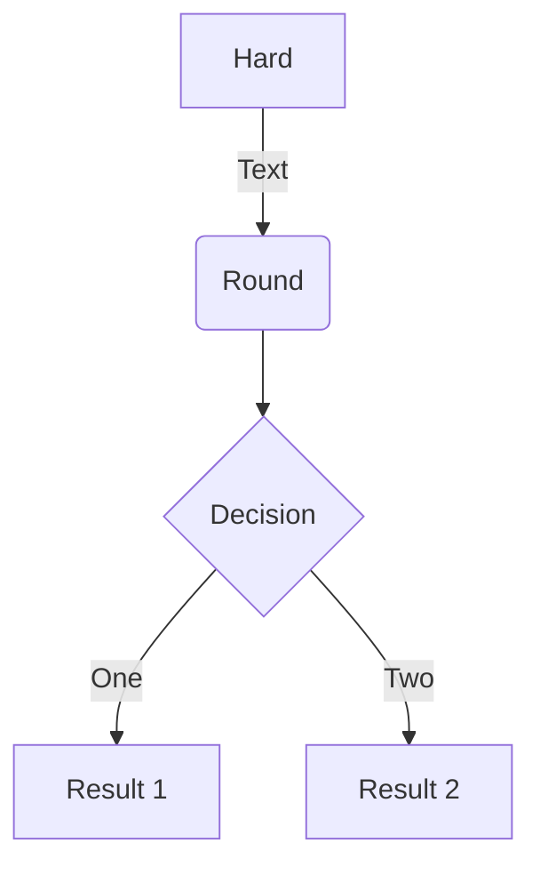
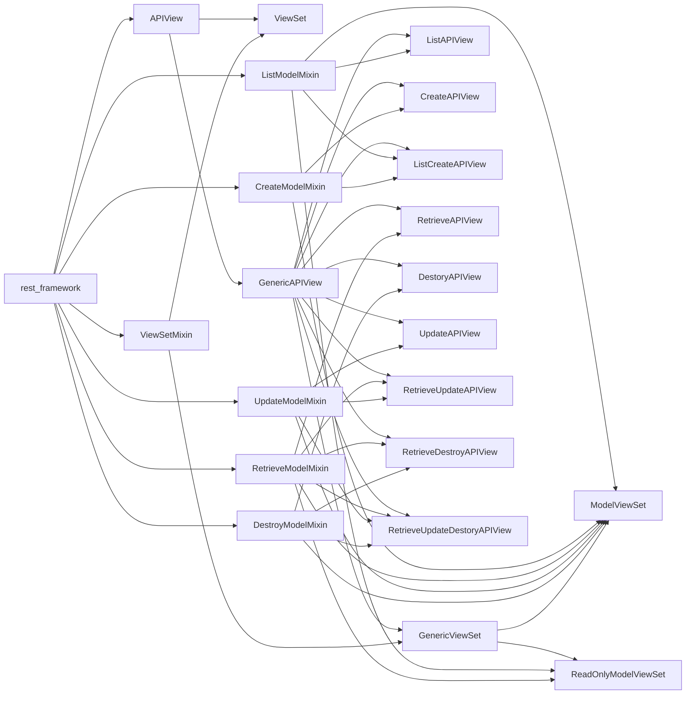
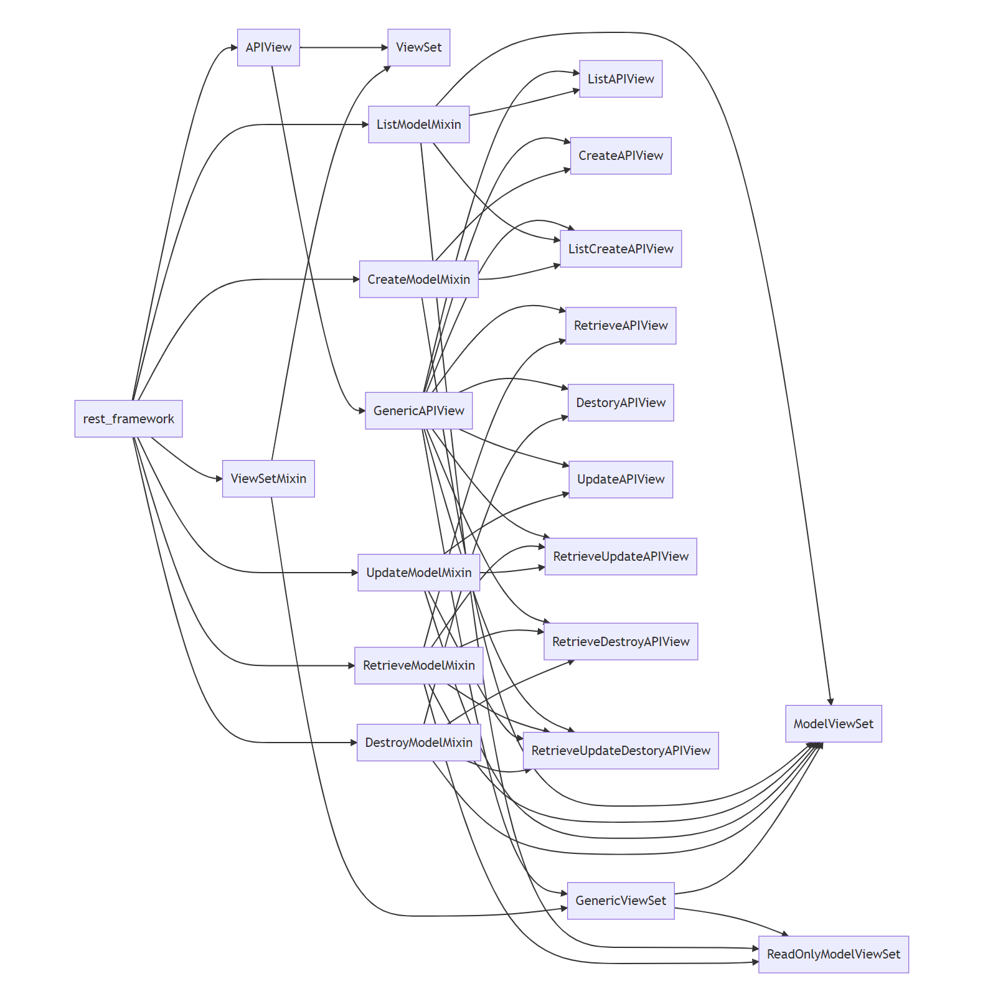

# Mermaid-图表绘制工具

## 前言

Mermaid 是一个基于 Javascript 的图表绘制工具，通过解析类 Markdown 的文本语法来实现图表的创建和动态修改。

- 项目仓库：<https://github.com/mermaid-js/mermaid/blob/develop/README.zh-CN.md>

?> 文档：<https://mermaid-js.github.io/mermaid/#/README>

VSCode 中 使用插件 Markdown Preview Enhanced 可以预览效果 & 在浏览器中导出。

## 示例 - 流程图

## rest-framework 视图关系

