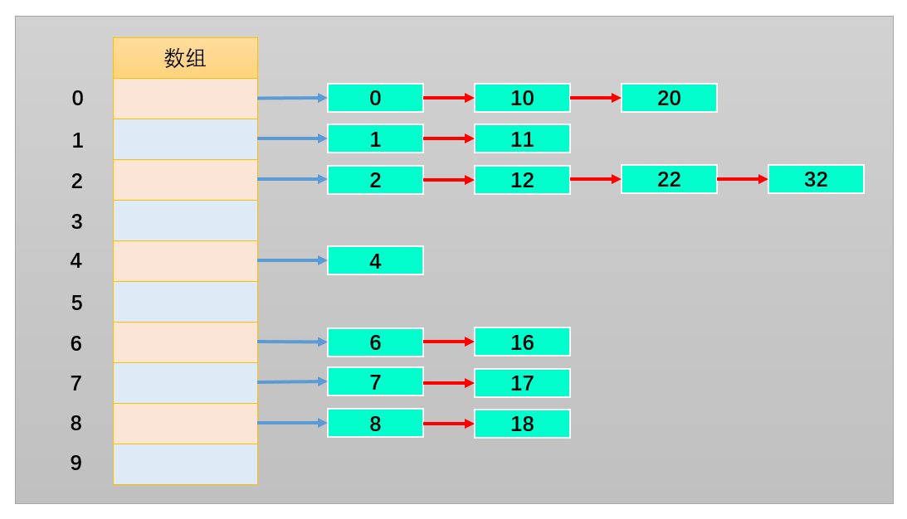
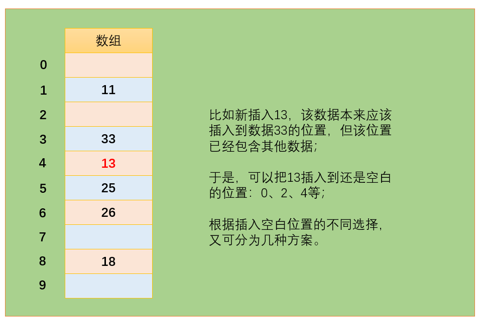
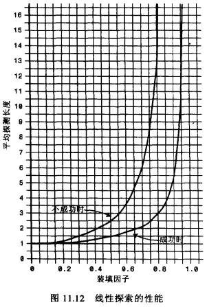
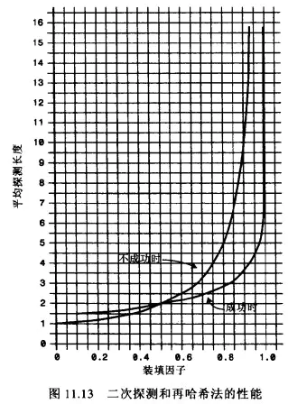
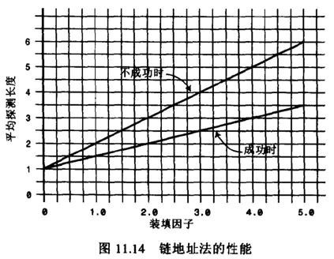

# 哈希表

## 一. 认识哈希表

### 哈希表介绍

* 哈希表通常是基于数组进行实现的, 但是相对于数组, 它也很多的优势:
  * 它可以提供非常快速的插入-删除-查找操作
  * 无论多少数据, 插入和删除值需要接近常量的时间: 即O(1)的时间级. 实际上, 只需要几个机器指令即可
  * 哈希表的速度比树还要快, 基本可以瞬间查找到想要的元素
  * 哈希表相对于树来说编码要容易很多.
* 哈希表相对于数组的一些不足:
  * 哈希表中的数据是没有顺序的, 所以不能以一种固定的方式(比如从小到大)来遍历其中的元素.
  * 通常情况下, 哈希表中的key是不允许重复的, 不能放置相同的key, 用于保存不同的元素.
* 哈希表到底是什么呢?
  * 哈希表不好理解的地方：不像数组和链表, 甚至是树一样直接画出你就知道它的结构, 甚至是原理了.
  * 它的结构就是数组, 但是它神奇的地方在于对下标值的一种变换, 这种变换我们可以称之为哈希函数, 通过哈希函数可以获取到HashCode.

### 字母转数字

* 我们需要设计一种方案, 可以将单词转成适当的下标:
* 方案一: 数字相加
  * 一个转换单词的简单方案就是把单词每个字符的编码求和.
  * 问题: 按照这种方案有一个很明显的问题就是很多单词最终的下标可能都相同。
* 方案二: 幂的连乘
  * 我们平时使用的大于10的数字, 可以用一种幂的连乘来表示它的唯一性:比如: 7654 = 7\*10³+6\*10²+5\*10+4
  * 单词也可以使用这种方案来表示: 比如cats = 3\*27³+1\*27²+20\*27+17= 60337
  * 这样得到的数字可以几乎保证它的唯一性, 不会和别的单词重复.
  * 问题: 如果一个单词是zzzzzzzzzz，那么得到的数字将超过7000000000000。
  * 就算能创建这么大的数组, 事实上有很多是无效的单词. 创建这么大的数组是没有意义的.

* 两种方案总结:

  * 第一种方案产生的数组下标太少。
  * 第二种方案产生的数组下标又太多。

### 认识哈希化

* 现在需要一种压缩方法, 把幂的连乘方案系统中得到的巨大整数范围压缩到可接受的数组范围中.
* 有一种简单的方法就是使用取余操作符, 它的作用是得到一个数被另外一个数整除后的余数.
哈希化相关概念：
* **哈希化**: 将大数字转化成数组范围内下标的过程, 我们就称之为哈希化。
* **哈希函数**: 通常我们会将单词转成大数字, 大数字在进行哈希化的代码现放在一个函数中, 这个函数我们成为哈希函数。
* **哈希表**: 最终将数据插入到的这个数组, 我们就称之为是一个哈希表。

## 二. 地址的冲突

> 哈希化过后的下标依然可能重复，这种情况我们成为冲突。

### 解决方案

如何解决冲突呢? 常见的情况有两种方案.

* 链地址法
* 开放地址法

### 链地址法

* 链地址法是一种比较常见的解决冲突的方案.(也称为拉链法)



* 链地址法解决冲突的办法是每个数组单元中存储的不再是单个数据, 而是一个链条.
* 这个链条使用什么数据结构呢? 常见的是数组或者链表.
* 当查询时, 先根据哈希化后的下标值找到对应的位置, 再取出链表, 依次查询找寻找的数据.

### 开放地址法

* 开放地址法的主要工作方式是寻找空白的单元格来添加重复的数据.



* 开放地址法其实就是要寻找空白的位置来放置冲突的数据项.
* 但是探索这个位置的方式不同, 有三种方法:
  * 线性探测
  * 二次探测
  * 再哈希法

#### 线性探测

* 线性探测非常好理解: 线性的查找空白的单元.
* 插入的32:
  * 经过哈希化得到的index=2, 但是在插入的时候, 发现该位置已经有了82. 怎么办呢?
  * 线性探测就是从index位置+1开始一点点查找空的位置来放置32.
* 查询32呢?
  * 首先经过哈希化得到index=2, 比如2的位置结果和查询的数值是否相同, 相同那么就直接返回.
  * 不相同呢? 线性查找, 从index位置+1开始查找和32一样的.
  * 这里有一个特别需要注意的地方: 查询过程有一个约定, 就是查询到空位置, 就停止. (因为查询到这里有空位置, 32之前不可能跳过空位置去其他的位置.)
* 删除32呢?
  * 删除操作一个数据项时, 不可以将这个位置下标的内容设置为null, 因为将它设置为null可能会影响我们之后查询其他操作, 所以通常删除一个位置的数据项时, 我们可以将它进行特殊处理(比如设置为-1).
  * 当我们之后看到-1位置的数据项时, 就知道查询时要继续查询, 但是插入时这个位置可以放置数据.
* 线性探测的问题:
  * 线性探测有一个比较严重的问题, 就是聚集. 什么是聚集呢?
  * 比如我在没有任何数据的时候, 插入的是22-23-24-25-26, 那么意味着下标值:2-3-4-5-6的位置都有元素. 这种一连串填充单元就叫做聚集.
  * 聚集会影响哈希表的性能, 无论是插入/查询/删除都会影响.
  * 比如我们插入一个32, 会发现连续的单元都不允许我们放置数据, 并且在这个过程中我们需要探索多次.
  * 二次探测可以解决一部分这个问题, 我们一起来看一看.

#### 二次探测

* 线性探测存在的问题: 就是如果之前的数据时连续插入的, 那么新插入的一个数据可能需要探测很长的距离.
* 二次探测在线性探测的基础上进行了优化:
  * 二次探测主要优化的是探测时的步长, 什么意思呢?
  * 线性探测, 我们可以看成是步长为1的探测, 比如从下标值x开始, 那么线性测试就是x+1, x+2, x+3依次探测.
  * 二次探测, 对步长做了优化, 比如从下标值x开始, x+1², x+2², x+3².
  * 这样就可以一次性探测比较常的距离, 比避免那些聚集带来的影响.
* 二次探测的问题:
  * 但是二次探测依然存在问题, 比如我们连续插入的是32-112-82-2-192, 那么它们依次累加的时候步长的相同的.
  * 也就是这种情况下会造成步长不一的一种聚集. 还是会影响效率.
  * 怎么根本解决这个问题呢? 让每个人的步长不一样, 一起来看看再哈希法吧.

#### 再哈希法

* 再哈希法:
  * 二次探测的算法产生的探测序列步长是固定的: 1, 4, 9, 16, 依次类推.
  * 现在需要一种方法: 产生一种依赖关键字的探测序列, 而不是每个关键字都一样.
  * 那么, 不同的关键字即使映射到相同的数组下标, 也可以使用不同的探测序列.
  * 再哈希法的做法就是: 把关键字用另外一个哈希函数, 再做一次哈希化, 用这次哈希化的结果作为步长.
* 再哈希化需要具备如下特点:
  * 不能和第一个哈希函数相同. (不然结果还是原来的位置)
  * 不能输出为0(否则, 将没有步长. 每次探测都是原地踏步, 算法就进入了死循环)
* 计算机专家已经设计出一种工作很好的哈希函数:
  * stepSize = constant - (key % constant)
  * 其中constant是质数, 且小于数组的容量.
  * 例如: stepSize = 5 - (key % 5), 满足需求, 并且结果不可能为0.

## 三. 哈希化的效率

> 哈希表中执行插入和搜索操作可以达到O(1)的时间级，如果没有发生冲突，只需要使用一次哈希函数和数组的引用，就可以插入一个新数据项或找到一个已经存在的数据项。
>
> 如果发生冲突，存取时间就依赖后来的探测长度。一个单独的查找或插入时间与探测的长度成正比，这里还要加上哈希函数的常量时间。
>
> 平均探测长度以及平均存取时间，取决于填装因子，随着填装因子变大，探测长度也越来越长。
>
> 随着填装因子变大，效率下降的情况，在开放地址法方案中比链地址法更严重.

### 装填因子

* 装填因子表示当前哈希表中已经包含的数据项和整个哈希表长度的比值.
  * 装填因子 = 总数据项 / 哈希表长度.
* 开放地址法的装填因子最大是1, 因为它必须寻找到空白的单元才能将元素放入.
* 链地址法的装填因子可以大于1, 因为拉链法可以无限的延伸下去,当然后面效率就变低了.

### 开放地址法

#### 线性探测

* 下面的等式显示了线性探测时，探测序列(P)和填装因子(L)的关系

  * 对成功的查找: P = (1+1/(1-L))/2
  * 对不成功的查找: P=(1+1/(1-L)^2)/2
* 公式来自于Knuth(算法分析领域的专家, 现代计算机的先驱人物), 这些公式的推导自己去看了一下, 确实有些繁琐, 这里不再给出推导过程, 仅仅说明它的效率.



* 图片解析:

  * 当填装因子是1/2时，成功的搜索需要1.5次比较，不成功的搜索需要2.5次
  * 当填装因子为2/3时，分别需要2.0次和5.0次比较
  * 如果填装因子更大，比较次数会非常大。
  * 应该使填装因子保持在2/3以下，最好在1/2以下，另一方面，填装因子越低，对于给定数量的数据项，就需要越多的空间。
  * 实际情况中，最好的填装因子取决于存储效率和速度之间的平衡，随着填装因子变小，存储效率下降，而速度上升。

#### 二次探测和再哈希

* 二次探测和再哈希法的性能相当。它们的性能比线性探测略好。

  * 对成功的搜索，公式是: -log2(1 - loadFactor) / loadFactor
  * 对于不成功的搜搜, 公式是: 1 / (1-loadFactor)



* 图片解析:

  * 当填装因子是0.5时，成功和不成的查找平均需要2次比较
  * 当填装因子为2/3时，分别需要2.37和3.0次比较
  * 当填装因子为0.8时，分别需要2.9和5.0次
  * 因此对于较高的填装因子，对比线性探测，二次探测和再哈希法还是可以忍受的。

### 链地址法

* 假如哈希表包含arraySize个数据项, 每个数据项有一个链表, 在表中一共包含N个数据项.
* 平均起来每个链表有 N / arraySize 个数据项.
* 有没有发现这个公式有点眼熟? 其实就是装填因子.
* 我们可以求出查找成功和不成功的次数：
  * 成功可能只需要查找链表的一半即可: 1 + loadFactor/2
  * 不成功可能需要将整个链表查询完才知道: 1 + loadFactor.
* 对应的图



### 效率的结论

* 链地址法相对来说效率是好于开放地址法的.
* 所以在真实开发中, 使用链地址法的情况较多, 因为它不会因为添加了某元素后性能急剧下降.比如在Java的HashMap中使用的就是链地址法.

## 四. 哈希函数

### 快速的计算

* 好的哈希函数应该尽可能让计算的过程变得简单, 应该可以快速计算出结果.
  * 提高速度的一个办法就是让哈希函数中尽量少的有乘法和除法.
* 在前面, 我们计算哈希值的时候使用的方式
  * cats = 3\*27³+1\*27²+20\*27+17= 60337
  * 我们抽象一下, 这个表达式其实是一个多项式: a(n)xn+a(n-1)x(n-1)+…+a(1)x+a(0)
  * 现在问题就变成了多项式有多少次乘法和加法:
    * 乘法次数: n＋(n－1)＋…＋1＝n(n+1)/2
    * 加法次数: n次
* 多项式的优化: 霍纳法则，也被称为秦九韶算法。


* 变换后, 我们需要多少次乘法, 多少次加法呢?
  * 乘法次数: N次
  * 加法次数: N次.
* 如果使用大O表示时间复杂度的话, 我们直接从O(N²)降到了O(N).

### 均匀的分布

* 均匀的分布
  * 在设计哈希表时, 我们已经有办法处理映射到相同下标值的情况: 链地址法或者开放地址法.
  * 但是, 为了提高效率, 最好的情况还是让数据在哈希表中均匀分布.
  * 因此, 我们需要在使用常量的地方, 尽量使用质数.
* 质数的使用:
  * 哈希表的长度.
  * N次幂的底数(我们之前使用的是27)
* 哈希表的长度使用质数:
  * 这个在链地址法中事实上重要性不是特别明显，明显的是在开放地址法中的再哈希法中.
  * 再哈希法中质数的重要性:
    * 假设表的容量不是质数, 例如: 表长为15(下标值0~14)
    * 有一个特定关键字映射到0, 步长为5. 探测序列是多少呢?
    * 0 - 5 - 10 - 0 - 5 - 10, 依次类推, 循环下去.
    * 算法只尝试着三个单元, 如果这三个单元已经有了数据, 那么会一直循环下去, 知道程序崩溃.
    * 如果容量是一个质数, 比如13. 探测序列是多少呢?
    * 0 - 5 - 10 - 2 - 7 - 12 - 4 - 9 - 1 - 6 - 11 - 3, 一直这样下去.
    * 不仅不会产生循环, 而且可以让数据在哈希表中更加均匀的分布.
* N次幂的底数, 使用质数:
  * 这里采用质数的原因是为了产生的数据不按照某种规律递增.
  * 比如我们这里有一组数据是按照4进行递增的: 0 4 8 12 16, 将其映射到长度为8的哈希表中.
  * 它们的位置是多少呢? 0 - 4 - 0 - 4, 依次类推.
  * 如果我们哈希表本身不是质数, 而我们递增的数量可以使用质数, 比如5, 那么 0 5 10 15 20
  * 它们的位置是多少呢? 0 - 5 - 2 - 7 - 4, 依次类推. 也可以尽量让数据均匀的分布.
  * 我们之前使用的是27, 这次可以使用一个接近的数, 比如31/37/41等等. 一个比较常用的数是37.

### 哈希函数实现

``` javascript
function hashFunc(str, max) {
    // 1.初始化hashCode的值
    var hashCode = 0

    // 2.霍纳算法, 来计算hashCode的数值
    for (var i = 0; i < str.length; i++) {
        hashCode = 37 * hashCode + str.charCodeAt(i)
    }

    // 3.取模运算
    hashCode = hashCode % max
    return hashCode
}
```

* 代码测试:

    ``` javascript
    alert(hashFunc("abc", 7)) // 4
    alert(hashFunc("cba", 7)) // 3
    alert(hashFunc("nba", 7)) // 5
    alert(hashFunc("mba", 7)) // 1
    ```

## 五. 哈希表

> 我们这里采用链地址法来实现哈希表:
>
> 实现的哈希表(基于storage的数组)每个index对应的是一个数组(bucket).
>
> bucket中存放什么呢? 我们最好将key和value都放进去, 我们继续使用一个数组.
>
> 最终哈希表的数据格式是这样: [ [ [k,v], [k,v], [k,v] ] , [ [k,v], [k,v] ], [ [k,v] ] ]

### 创建哈希表

``` javascript
// 创建HashTable构造函数
function HashTable() {
    // 定义属性
    this.storage = []
    this.count = 0
    this.limit = 8

    // 定义相关方法
    // 哈希函数
    HashTable.prototype.hashFunc = function(str, max) {
        // 1.初始化hashCode的值
        var hashCode = 0

        // 2.霍纳算法, 来计算hashCode的数值
        for (var i = 0; i < str.length; i++) {
            hashCode = 37 * hashCode + str.charCodeAt(i)
        }
      
        // 3.取模运算
        hashCode = hashCode % max
        return hashCode
    }
}
```

* 代码解析:
  * storage作为我们的数组, 数组中存放相关的元素.
  * count表示当前已经存在了多少数据.
  * limit用于标记数组中一共可以存放多少个元素.
  * 另外, 我们直接将哈希函数定义在了HashTable中.

### 插入&修改数据

``` javascript
// 插入数据方法
HashTable.prototype.put = function (key, value) {
    // 1.获取key对应的index
    var index = this.hashFunc(key, this.limit)

    // 2.取出数组(也可以使用链表)
    var bucket = this.storage[index]

    // 3.判断这个数组是否存在
    if (bucket === undefined) {
        // 3.1创建桶
        bucket = []
        this.storage[index] = bucket
    }
    alert(bucket)
    
    // 4.判断是新增还是修改原来的值.
    var override = false
    for (var i = 0; i < bucket.length; i++) {
        var tuple = bucket[i]
        if (tuple[0] === key) {
            tuple[1] = value
            override = true
        }
    }
    
    // 5.如果是新增, 前一步没有覆盖
    if (!override) {
        bucket.push([key, value])
        this.count++
    }
}
```

* 代码解析:

  * 步骤1: 根据传入的key获取对应的hashCode, 也就是数组的index
  * 步骤2: 从哈希表的index位置中取出桶(另外一个数组)
  * 步骤3: 查看上一步的bucket是否为null
    * 为null, 表示之前在该位置没有放置过任何的内容, 那么就新建一个数组\[\]
  * 步骤4: 查看是否之前已经放置过key对应的value
    * 如果放置过, 那么就是依次替换操作, 而不是插入新的数据.
    * 我们使用一个变量override来记录是否是修改操作
  * 步骤5: 如果不是修改操作, 那么插入新的数据.
    * 在bucket中push新的[key, value]即可.
    * 注意: 这里需要将count+1, 因为数据增加了一项.

### 获取数据

* 有插入和修改数据, 就应该有根据key获取value

``` javascript
// 获取存放的数据
HashTable.prototype.get = function (key) {
    // 1.获取key对应的index
    var index = this.hashFunc(key, this.limit)

    // 2.获取对应的bucket
    var bucket = this.storage[index]

    // 3.如果bucket为null, 那么说明这个位置没有数据
    if (bucket == null) {
        return null
    }

    // 4.有bucket, 判断是否有对应的key
    for (var i = 0; i < bucket.length; i++) {
        var tuple = bucket[i]
        if (tuple[0] === key) {
            return tuple[1]
        }
    }
    
    // 5.没有找到, return null
    return null
}
```

* 代码解析:

  * 步骤1: 根据key获取hashCode(也就是index)
  * 步骤2: 根据index取出bucket.
  * 步骤3: 因为如果bucket都是null, 那么说明这个位置之前并没有插入过数据.
  * 步骤4: 有了bucket, 就遍历, 并且如果找到, 就将对应的value返回即可.
  * 步骤5: 没有找到, 返回null

### 删除数据

* 根据对应的key, 删除对应的key/value

``` javascript
// 删除数据
HashTable.prototype.remove = function (key) {
    // 1.获取key对应的index
    var index = this.hashFunc(key, this.limit)
    
    // 2.获取对应的bucket
    var bucket = this.storage[index]
    
    // 3.判断同是否为null, 为null则说明没有对应的数据
    if (bucket == null) {
        return null
    }
    
    // 4.遍历bucket, 寻找对应的数据
    for (var i = 0; i < bucket.length; i++) {
        var tuple = bucket[i]
        if (tuple[0] === key) {
            bucket.splice(i, 1)
            this.count--
            return tuple[1]
        }
    }
    
    // 5.来到该位置, 说明没有对应的数据, 那么返回null
    return null
}
```

### 其他方法

* 判断哈希表是否为空: isEmpty

``` javascript
// isEmpty方法
HashTable.prototype.isEmpty = function () {
    return this.count == 0
}
```

* 获取哈希表中数据的个数

``` javascript
// size方法
HashTable.prototype.size = function () {
    return this.count
}
```

### 哈希表测试

``` javascript
// 测试哈希表
// 1.创建哈希表
var ht = new HashTable()

// 2.插入数据
ht.put("abc", "123")
ht.put("cba", "321")
ht.put("nba", "521")
ht.put("mba", "520")

// 3.获取数据
alert(ht.get("abc"))
ht.put("abc", "111")
alert(ht.get("abc"))

// 4.删除数据
alert(ht.remove("abc"))
alert(ht.get("abc"))
```

## 六. 哈希表扩容

### 哈希表扩容的思想

* 为什么需要扩容?
  * 我们使用的是链地址法, loadFactor可以大于1, 所以这个哈希表可以无限制的插入新数据.
  * 但是, 随着数据量的增多, 每一个index对应的bucket会越来越长, 也就造成效率的降低.
* 如何进行扩容?
  * 扩容可以简单的将容量增加大两倍(不是质数吗? 质数的问题后面再讨论)
  * 但是这种情况下, 所有的数据项一定要同时进行修改(重新哈希化, 来获取到不同的位置)
  * 比如hashCode=12的数据项, 在length=8的时候, index=4. 在长度为16的时候呢? index=12.
  * 这是一个耗时的过程, 但是如果数组需要扩容, 那么这个过程是必要的.
* 什么情况下扩容呢?
  * 比较常见的情况是loadFactor>0.75的时候进行扩容.
  * 比如Java的哈希表就是在装填因子大于0.75的时候, 对哈希表进行扩容.

### 哈希表扩容的实现

``` javascript
// 哈希表扩容
HashTable.prototype.resize = function (newLimit) {
    // 1.保存旧的数组内容
    var oldStorage = this.storage

    // 2.重置属性
    this.limit = newLimit
    this.count = 0
    this.storage = []

    // 3.遍历旧数组中的所有数据项, 并且重新插入到哈希表中
    oldStorage.forEach(function (bucket) {
        // 1.bucket为null, 说明这里面没有数据
        if (bucket == null) {
            return
        }

        // 2.bucket中有数据, 那么将里面的数据重新哈希化插入
        for (var i = 0; i < bucket.length; i++) {
            var tuple = bucket[i]
            this.put(tuple[0], tuple[1])
        }
    }.bind(this))
}
```

* 代码解析:
  * 步骤1: 先将之前数组保存起来, 因为我们待会儿会将storeage = \[\]
  * 步骤2: 之前的属性值需要重置.
  * 步骤3: 遍历所有的数据项, 重新插入到哈希表中.

* 在什么时候调用扩容方法呢?
  * 在每次添加完新的数据时, 都进行判断. (也就是put方法中)
* 修改put方法，代码第5步中的内容

``` javascript
// 插入数据方法
HashTable.prototype.put = function (key, value) {
    // 1.获取key对应的index
    var index = this.hashFunc(key, this.limit)

    // 2.取出数组(也可以使用链表)
    // 数组中放置数据的方式: [[ [k,v], [k,v], [k,v] ] , [ [k,v], [k,v] ]  [ [k,v] ] ]
    var bucket = this.storage[index]

    // 3.判断这个数组是否存在
    if (bucket === undefined) {
        // 3.1创建桶
        bucket = []
        this.storage[index] = bucket
    }

    // 4.判断是新增还是修改原来的值.
    var override = false
    for (var i = 0; i < bucket.length; i++) {
        var tuple = bucket[i]
        if (tuple[0] === key) {
            tuple[1] = value
            override = true
        }
    }

    // 5.如果是新增, 前一步没有覆盖
    if (!override) {
        bucket.push([key, value])
        this.count++
        // 数组扩容
        if (this.count > this.limit * 0.75) {
            this.resize(this.limit * 2)
        }
    }
}
```

* 如果我们不断的删除数据呢?

  * 如果不断的删除数据, 当loadFactor < 0.25的时候, 最好将数量限制在一半.
* 修改remove方法，代码第4步中的内容

``` javascript
// 删除数据
HashTable.prototype.remove = function (key) {
    // 1.获取key对应的index
    var index = this.hashFunc(key, this.limit)

    // 2.获取对应的bucket
    var bucket = this.storage[index]

    // 3.判断同是否为null, 为null则说明没有对应的数据
    if (bucket == null) {
        return null
    }

    // 4.遍历bucket, 寻找对应的数据
    for (var i = 0; i < bucket.length; i++) {
        var tuple = bucket[i]
        if (tuple[0] === key) {
            bucket.splice(i, 1)
            this.count--
            
            // 缩小数组的容量
            if (this.limit > 8 && this.count < this.limit * 0.25) {
                this.resize(Math.floor(this.limit / 2))
            }
        }
        return tuple[1]
    }

    // 5.来到该位置, 说明没有对应的数据, 那么返回null
    return null
}
```

## 七. 质数容量

> 我们前面提到过, 容量最好是质数.
>
> 虽然在链地址法中将容量设置为质数, 没有在开放地址法中重要, 但是其实链地址法中质数作为容量也更利于数据的均匀分布.

### 判断质数

* 质数的特点:
  * 质数也称为素数.
  * 质数表示大于1的自然数中, 只能被1和自己整除的数.

``` javascript
function isPrime(num) {
    for (var i = 2; i < num; i++) {
        if (num % i == 0) {
            return false
        }
    }
    return true
}

// 测试
alert(isPrime(3)) // true
alert(isPrime(32)) // false
alert(isPrime(37)) // true
```

* 但是, 这种做法的效率并不高. 为什么呢?

  * 对于每个数n，其实并不需要从2判断到n-1
  * 其实我们遍历到等于sqrt(n)即可

``` javascript
function isPrime(num) {
    // 1.获取平方根
    var temp = parseInt(Math.sqrt(num))

    // 2.循环判断
    for (var i = 2; i <= temp; i++) {
        if (num % i == 0) {
            return false
        }
    }
    return true
}
```

### 扩容的质数

* 首先, 将初始的limit为8, 改成7

* 前面, 我们有对容量进行扩展, 方式是: 原来的容量 x 2

  * 比如之前的容量是7, 那么扩容后就是14. 14还是一个质数吗?
  * 显然不是, 所以我们还需要一个方法, 来实现一个新的容量为质数的算法.
* 那么我们可以封装获取新的容量(质数)的代码

``` javascript
// 判断是否是质数
HashTable.prototype.isPrime = function (num) {
    var temp = parseInt(Math.sqrt(num))
    // 2.循环判断
    for (var i = 2; i <= temp; i++) {
        if (num % i == 0) {
            return false
        }
    }
    return true
}

// 获取质数
HashTable.prototype.getPrime = function (num) {
    while (!isPrime(num)) {
        num++
    }
    return num
}
```

* 修改插入和删除的代码:

* 插入数据的代码:

``` javascript
// 扩容数组的数量
if (this.count > this.limit * 0.75) {
    var primeNum = this.getPrime(this.limit * 2)
    this.resize(primeNum)
}
```

* 删除数据的代码:

``` javascript
// 缩小数组的容量
if (this.limit > 7 && this.count < this.limit * 0.25) {
    var primeNum = this.getPrime(Math.floor(this.limit / 2))
    this.resize(primeNum)
}
```

## 八. 完整代码

``` javascript
// 创建HashTable构造函数
function HashTable() {
    // 定义属性
    this.storage = []
    this.count = 0
    this.limit = 8

    // 定义相关方法
    // 判断是否是质数
    HashTable.prototype.isPrime = function (num) {
        var temp = parseInt(Math.sqrt(num))
        // 2.循环判断
        for (var i = 2; i <= temp; i++) {
            if (num % i == 0) {
                return false
            }
        }
        return true
    }

    // 获取质数
    HashTable.prototype.getPrime = function (num) {
        while (!isPrime(num)) {
            num++
        }
        return num
    }

    // 哈希函数
    HashTable.prototype.hashFunc = function(str, max) {
        // 1.初始化hashCode的值
        var hashCode = 0

        // 2.霍纳算法, 来计算hashCode的数值
        for (var i = 0; i < str.length; i++) {
            hashCode = 37 * hashCode + str.charCodeAt(i)
        }

        // 3.取模运算
        hashCode = hashCode % max
        return hashCode
    }

    // 插入数据方法
    HashTable.prototype.put = function (key, value) {
        // 1.获取key对应的index
        var index = this.hashFunc(key, this.limit)

        // 2.取出数组(也可以使用链表)
        // 数组中放置数据的方式: [[ [k,v], [k,v], [k,v] ] , [ [k,v], [k,v] ]  [ [k,v] ] ]
        var bucket = this.storage[index]

        // 3.判断这个数组是否存在
        if (bucket === undefined) {
            // 3.1创建桶
            bucket = []
            this.storage[index] = bucket
        }

        // 4.判断是新增还是修改原来的值.
        var override = false
        for (var i = 0; i < bucket.length; i++) {
            var tuple = bucket[i]
            if (tuple[0] === key) {
                tuple[1] = value
                override = true
            }
        }

        // 5.如果是新增, 前一步没有覆盖
        if (!override) {
            bucket.push([key, value])
            this.count++

            if (this.count > this.limit * 0.75) {
                var primeNum = this.getPrime(this.limit * 2)
                this.resize(primeNum)
            }
        }
    }

    // 获取存放的数据
    HashTable.prototype.get = function (key) {
        // 1.获取key对应的index
        var index = this.hashFunc(key, this.limit)

        // 2.获取对应的bucket
        var bucket = this.storage[index]

        // 3.如果bucket为null, 那么说明这个位置没有数据
        if (bucket == null) {
            return null
        }

        // 4.有bucket, 判断是否有对应的key
        for (var i = 0; i < bucket.length; i++) {
            var tuple = bucket[i]
            if (tuple[0] === key) {
                return tuple[1]
            }
        }

        // 5.没有找到, return null
        return null
    }

    // 删除数据
    HashTable.prototype.remove = function (key) {
        // 1.获取key对应的index
        var index = this.hashFunc(key, this.limit)

        // 2.获取对应的bucket
        var bucket = this.storage[index]

        // 3.判断同是否为null, 为null则说明没有对应的数据
        if (bucket == null) {
            return null
        }

        // 4.遍历bucket, 寻找对应的数据
        for (var i = 0; i < bucket.length; i++) {
            var tuple = bucket[i]
            if (tuple[0] === key) {
                bucket.splice(i, 1)
                this.count--

                // 缩小数组的容量
                if (this.limit > 7 && this.count < this.limit * 0.25) {
                    var primeNum = this.getPrime(Math.floor(this.limit / 2))
                    this.resize(primeNum)
                }
            }
            return tuple[1]
        }

        // 5.来到该位置, 说明没有对应的数据, 那么返回null
        return null
    }

    // isEmpty方法
    HashTable.prototype.isEmpty = function () {
        return this.count == 0
    }

    // size方法
    HashTable.prototype.size = function () {
        return this.count
    }

    // 哈希表扩容
    HashTable.prototype.resize = function (newLimit) {
        // 1.保存旧的数组内容
        var oldStorage = this.storage

        // 2.重置属性
        this.limit = newLimit
        this.count = 0
        this.storage = []

        // 3.遍历旧数组中的所有数据项, 并且重新插入到哈希表中
        oldStorage.forEach(function (bucket) {
            // 1.bucket为null, 说明这里面没有数据
            if (bucket == null) {
                return
            }

            // 2.bucket中有数据, 那么将里面的数据重新哈希化插入
            for (var i = 0; i < bucket.length; i++) {
                var tuple = bucket[i]
                this.put(tuple[0], tuple[1])
            }
        }).bind(this)
    }
}
```
