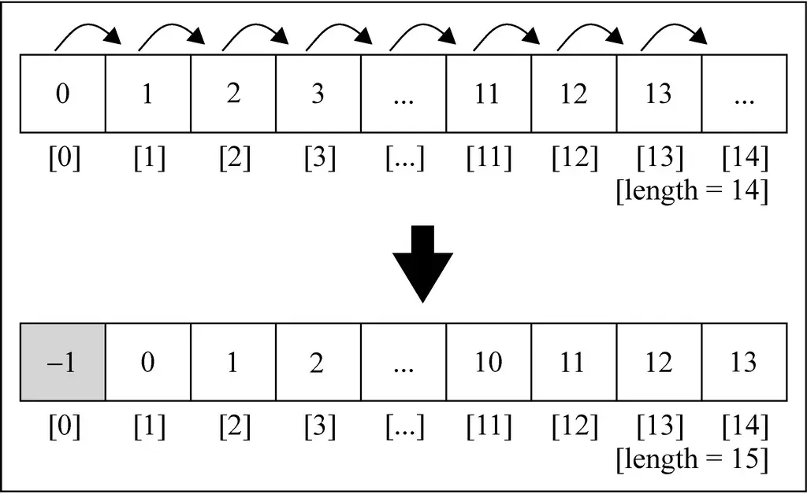

# 数组

## 一. 数组的基本使用

### 创建数组

* `new Array()`

    ``` javascript
    var daysOfWeek = new Array('Sunday', 'Monday', 'Tuesday', 'Wednesday',
        'Thursday', 'Friday', 'Saturday')
    ```

* 使用中括号（`[]`）创建数组

    ``` javascript
    var daysOfWeek = ['Sunday', 'Monday', 'Tuesday', 'Wednesday',
        'Thursday', 'Friday', 'Saturday'];
    ```

### 数组长度和遍历数组

* 如果我们希望获取数组的长度, 有一个length属性

    ``` javascript
    // 获取数组的长度
    alert(daysOfWeek.length)
    ```

* 也可以通过下标值来遍历数组:

    ``` javascript
    // 普通for方式遍历数组
    for (var i = 0; i < daysOfWeek.length; i++) {
        alert(daysOfWeek[i])
    }
    
    // 通过foreach遍历数组
    daysOfWeek.forEach(function (value) {
        alert(value)
    })
    ```

* 我们来做一个练习，求菲波那切数列的前20个数字, 并且放在数组中:

    ``` javascript
    // 求菲波那切数列的前20个数字
    var fibonacci = []
    fibonacci[0] = 1
    fibonacci[1] = 1
    
    for (var i = 2; i < 20; i++) {
        fibonacci[i] = fibonacci[i - 1] + fibonacci[i - 2]
    }
    
    alert(fibonacci)
    ```

## 二. 数组的常见操作

> 数组中常见的操作有: 添加元素、删除元素、修改元素、获取元素.

### 添加元素

* 假如我们有一个数组: numbers, 初始化0~9

    ``` javascript
    // 初始化一个数组
    var numbers = [0, 1, 2, 3, 4, 5, 6, 7, 8, 9]
    ```

* 添加一个元素到数组的最后位置:

    ``` javascript
    // 添加一个元素到数组的最后位置
    // 方式一:
    numbers[numbers.length] = 10
    
    // 方式二:
    numbers.push(11)
    numbers.push(12, 13)
    
    alert(numbers)
    ```

* 在数组首位插入一个元素:

    ``` javascript
    // 在数组首位插入一个元素
    for (var i = numbers.length; i > 0; i--) {
        numbers[i] = numbers[i-1]
    }
    numbers[0] = -1
    alert(numbers) // -1,0,1,2,3,4,5,6,7,8,9,10,11,12,13
    ```

* 上面代码实现的原理是怎样的呢?



* 考虑上面代码实现的性能怎么呢?

  * 性能并不算非常高
  * 这也是数组和链表(后面我们会学习到)相对比的一个劣势: 在中间位置插入元素的效率比链表低.
* 当然, 我们在数组首位插入数据可以直接使用unshift方法

    ``` javascript
    // 通过unshift在首位插入数据
    numbers.unshift(-2)
    numbers.unshift(-4, -3)
    alert(numbers) // -4,-3,-2,-1,0,1,2,3,4,5,6,7,8,9,10,11,12,13
    ```

### 删除元素

* 如果希望删除数组最后的元素, 可以使用pop()方法

    ``` javascript
    // 删除最后的元素
    numbers.pop()
    alert(numbers) // -4,-3,-2,-1,0,1,2,3,4,5,6,7,8,9,10,11,12
    ```

* 如果我们希望移除的首位元素, 自己实现代码:

    ``` javascript
    // 删除首位的元素
    for (var i = 0; i < numbers.length; i++) {
        numbers[i] = numbers[i+1]
    }
    numbers.pop()
    alert(numbers)
    ```

* 当然, 我们可以直接使用shift方法来实现:

    ``` javascript
    numbers.shift()
    alert(numbers)
    ```

### 任意位置

* 一方面, 我们可以自己封装这样的函数, 但JS已经给我们提供了一个splice方法

* 通过splice删除数据

    ``` javascript
    // 删除指定位置的几个元素
    numbers.splice(5, 3)
    alert(numbers) // -4,-3,-2,-1,0,4,5,6,7,8,9,10,11,12,13
    ```

* 使用splice插入数据

    ``` javascript
    // 插入指定位置元素
    numbers.splice(5, 0, 3, 2, 1)
    alert(numbers) // -4,-3,-2,-1,0,3,2,1,4,5,6,7,8,9,10,11,12,13
    ```

* 使用splice修改数据

    ``` javascript
    // 修改指定位置的元素
    numbers.splice(5, 3, "a", "b", "c")
    alert(numbers) // -4,-3,-2,-1,0,a,b,c,4,5,6,7,8,9,10,11,12,13
    ```

## 三. 数组的其他操作

### 常见方法

| 方法名 | 方法描述 |
| --- | --- |
| `concat` | 连接2个或更多数组，并返回结果 |
| `every` | 对数组中的每一项运行给定函数，如果该函数对每一项返回 `true`，则返回`true`, 否则返回`false` |
| `filter` | 对数组中的每一项运行给定函数，返回该函数会返回`true`的项组成的数组 |
| `forEach` | 对数组中的每一项运行给定函数。这个方法没有返回值|
| `join` | 将所有的数组元素连接成一个字符串 |
| `indexOf` | 返回第一个与给定参数相等的数组元素的索引，没有到则返回-1 |
| `lastIndexOf` | 返回在数组中搜索到的与给定参数相等的元素的引里最大的值 |
| `map` | 对数组中的每一项运行给定函数，返回每次函数调用的结组成的数组 |
| `reverse` | 颠倒数组中元素的顺序，原先第一个元素现在变成最一个，同样原先的最后一个元素变成了现在的第一个 |
| `slice` | 传入索引值，将数组里对应索引范围内的元素作为新数返回 |
| `some` | 对数组中的每一项运行给定函数，如果任一项返回`true`，则结果为`true`, 并且迭代结束 |
| `sort` | 按照字母顺序对数组排序，支持传入指定排序方法的函数为参数 |
| `toString` | 将数组作为字符串返回 |
| `valueOf` | 和 `toString`类似，将数组作为字符串返回 |

### 数组合并

* 使用concat(也可以直接+进行合并)

    ``` javascript
    // 数组的合并
    var nums1 = [1, 2, 3]
    var nums2 = [100, 200, 300]
    var newNums = nums1.concat(nums2)
    alert(newNums) // 1,2,3,100,200,300
    
    newNums = nums1 + nums2
    alert(newNums) // 1,2,3,100,200,300
    ```

### 迭代方法

* every()方法

  * every()方法是将数组中每一个元素传入到一个函数中, 该函数返回true/false.
  * 如果函数中每一个元素都返回true, 那么结果为true, 有一个为false, 那么结果为false
* every()练习:

    ``` javascript
    // 定义数组
    var names = ["abc", "cb", "mba", "dna"]
    
    // 判断数组的元素是否都包含a字符
    var flag = names.every(function (t) {
        return t.indexOf('a') != -1
    })
    alert(flag)
    ```

* some()方法

  * some()方法是将数组中每一个元素传入到一个函数中, 该函数返回true/false
  * 但是和every不同的是, 一旦有一次函数返回了true, 那么迭代就会结束. 并且结果为true
* some()练习

    ``` javascript
    // 定义数组
    var names = ["abc", "cb", "mba", "dna"]
    
    // 判断数组中是否包含有a字符的字符
    var flag = names.some(function (t) {
        alert(t)
        return t.indexOf("a") != -1
    })
    alert(flag)
    ```

* forEach()方法

  * forEach()方法仅仅是一种快速迭代数组的方式而已.
  * 该方法不需要返回值
* forEach的使用

    ``` javascript
    // 定义数组
    var names = ["abc", "cb", "mba", "dna"]
    
    // forEach的使用
    names.forEach(function (t) {
        alert(t)
    })
    ```

* filter()方法

  * filter()方法是一种过滤的函数
  * 首先会遍历数组中每一个元素传入到函数中
  * 函数的结果返回true, 那么这个元素会被添加到最新的数组中, 返回false, 则忽略该元素.
  * 最终会形成一个新的数组, 该数组就是filter()方法的返回值
* filter()的练习:

    ``` javascript
    // 定义数组
    var names = ["abc", "cb", "mba", "dna"]
    
    // 获取names中所有包含'a'字符的元素
    var newNames = names.filter(function (t) {
        return t.indexOf("a") != -1
    })
    alert(newNames)
    ```

* map()方法

  * map()方法提供的是一种映射函数.
  * 首先会遍历数组中每一个元素传入到函数中.
  * 元素会经过函数中的指令进行各种变换, 生成新的元素, 并且将新的元素返回.
  * 最终会将返回的所有元素形成一个新的数组, 该数组就是map()方法的返回值
* map()练习:

    ``` javascript
    // 定义数组
    var names = ["abc", "cb", "mba", "dna"]
    
    // 在names中所有的元素后面拼接-abc
    var newNames = names.map(function (t) {
        return t + "-abc"
    })
    alert(newNames)
    ```

### reduce方法

* 首先, 我们来看这个方法需要的参数:

    ``` javascript
    arr.reduce(callback[, initialValue])
    ```

* 参数

  * callback（一个在数组中每一项上调用的函数，接受四个函数：）
    * previousValue（上一次调用回调函数时的返回值，或者初始值）
    * currentValue（当前正在处理的数组元素）
    * currentIndex（当前正在处理的数组元素下标）
    * array（调用reduce()方法的数组）
  * initialValue（可选的初始值。作为第一次调用回调函数时传给previousValue的值）
* 求一个数字中数字的累加和：
* 使用for实现:

    ``` javascript
    // 1.定义数组
    var numbers = [1, 2, 3, 4]
    
    // 2.for实现累加
    var total = 0
    for (var i = 0; i < numbers.length; i++) {
        total += numbers[i]
    }
    alert(total) // 10
    ```

* 使用forEach简化for循环

    ``` javascript
    // 3.使用forEach
    var total = 0
    numbers.forEach(function (t) {
        total += t
    })
    alert(total)
    ```

* 使用reduce方法实现

    ``` javascript
    // 4.使用reduce方法
    var total = numbers.reduce(function (pre, cur) {
        return pre + cur
    })
    alert(total)
    ```
