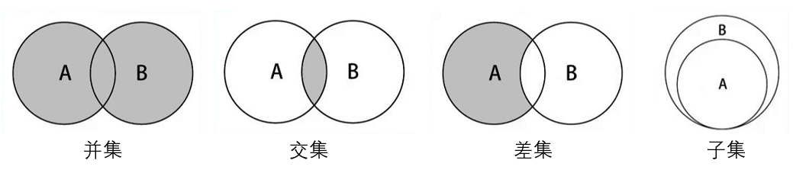

# 集合

## 一. 集合特点

* 集合通常是由一组无序的, 不能重复的元素构成。

## 二. 封装集合

### 创建集合类

``` javascript
// 封装集合的构造函数
function Set() {
    // 使用一个对象来保存集合的元素
    this.items = {} 
    
    // 集合的操作方法
}
```

* 代码解析:

  * 代码就是封装了一个集合的构造函数.
  * 在集合中, 添加了一个items属性, 用于保存之后添加到集合中的元素. 因为Object的keys本身就是一个集合.

### 方法

> * `add(value)`：向集合添加一个新的项。
> * `remove(value)`：从集合移除一个值。
> * `has(value)`：如果值在集合中，返回`true`，否则返回`false`。
> * `clear()`：移除集合中的所有项。
> * `size()`：返回集合所包含元素的数量。与数组的length属性类似。
> * `values()`：返回一个包含集合中所有值的数组。

* `has(value)`方法

    ``` javascript
    // 判断集合中是否有某个元素
    Set.prototype.has = function (value) {
        return this.items.hasOwnProperty(value)
    }
    ```

* `add`方法

    ``` javascript
    // 向集合中添加元素
    Set.prototype.add = function (value) {
        // 1.判断集合中是否已经包含了该元素
        if (this.has(value)) return false
    
        // 2.将元素添加到集合中
        this.items[value] = value
        return true
    }
    ```

* `remove`方法

    ``` javascript
    // 从集合中删除某个元素
    Set.prototype.remove = function (value) {
        // 1.判断集合中是否包含该元素
        if (!this.has(value)) return false
    
        // 2.包含该元素, 那么将元素删除
        delete this.items[value]
        return true
    }
    ```

* `clear`方法

    ``` javascript
    // 清空集合中所有的元素
    Set.prototype.clear = function () {
        this.items = {}
    }
    ```

* `size`方法

    ``` javascript
    // 获取集合的大小
    Set.prototype.size = function () {
        return Object.keys(this.items).length
        
        /*
        考虑兼容性问题, 使用下面的代码
        var count = 0
        for (var value in this.items) {
            if (this.items.hasOwnProperty(value)) {
                count++
            }
        }
        return count
        */
    }
    ```

* `values`方法

    ``` javascript
    // 获取集合中所有的值
    Set.prototype.values = function () {
        return Object.keys(this.items)
    
        /*
        考虑兼容性问题, 使用下面的代码
        var keys = []
        for (var value in this.items) {
            keys.push(value)
        }
        return keys
        */
    }
    ```

### 代码测试

``` javascript
// 测试和使用集合类
var set = new Set()

// 添加元素
set.add(1)
alert(set.values()) // 1
set.add(1)
alert(set.values()) // 1

set.add(100)
set.add(200)
alert(set.values()) // 1,100,200

// 判断是否包含元素
alert(set.has(100)) // true

// 删除元素
set.remove(100)
alert(set.values()) // 1, 200

// 获取集合的大小
alert(set.size()) // 2
set.clear()
alert(set.size()) // 0
```

### 完整代码

``` javascript
// 封装集合的构造函数
function Set() {
    // 使用一个对象来保存集合的元素
    this.items = {}

    // 集合的操作方法
    // 判断集合中是否有某个元素
    Set.prototype.has = function (value) {
        return this.items.hasOwnProperty(value)
    }

    // 向集合中添加元素
    Set.prototype.add = function (value) {
        // 1.判断集合中是否已经包含了该元素
        if (this.has(value)) return false

        // 2.将元素添加到集合中
        this.items[value] = value
        return true
    }

    // 从集合中删除某个元素
    Set.prototype.remove = function (value) {
        // 1.判断集合中是否包含该元素
        if (!this.has(value)) return false

        // 2.包含该元素, 那么将元素删除
        delete this.items[value]
        return true
    }

    // 清空集合中所有的元素
    Set.prototype.clear = function () {
        this.items = {}
    }

    // 获取集合的大小
    Set.prototype.size = function () {
        return Object.keys(this.items).length

        /*
        考虑兼容性问题, 使用下面的代码
        var count = 0
        for (var value in this.items) {
            if (this.items.hasOwnProperty(value)) {
                count++
            }
        }
        return count
        */
    }

    // 获取集合中所有的值
    Set.prototype.values = function () {
        return Object.keys(this.items)

        /*
        考虑兼容性问题, 使用下面的代码
        var keys = []
        for (var value in this.items) {
            keys.push(value)
        }
        return keys
        */
    }
}
```

## 三. 集合间的操作

### 操作方法

* 并集：对于给定的两个集合，返回一个包含两个集合中所有元素的新集合；
* 交集：对于给定的两个集合，返回一个包含两个集合中共有元素的新集合；
* 差集：对于给定的两个集合，返回一个包含所有存在于第一个集合且不存在于第二个集合的元素的新集合；
* 子集：验证一个给定集合是否是另一个集合的子集；



### 代码实现

* 并集：创建集合C代表集合A和集合B的并集，先将集合A中的所有元素添加到集合C中，再遍历集合B，如果是集合C所没有的元素就把它添加到集合C中。

``` javascript
 Set.prototype.union = otherSet => {
      // this:集合对象A
      // otherSet:集合对象B
      //1.创建一个新的集合
      let unionSet = new Set()

      //2.将A集合中的所有元素添加到新集合中
      let values = this.values()
      // for(let i of values){
      //   unionSet.add(i)
      // }
      for(let i = 0;i < values.length;i++){
        unionSet.add(values[i])
      }

      //3.取出B集合中的元素,判断是否需要加到新集合中
      values = otherSet.values()
      // for(let i of values){
      //   //由于集合的add方法已经对重复的元素进行了判断,所以这里可以直接添加
      //   unionSet.add(i)
      // }
      for(let i = 0;i < values.length;i++){
        unionSet.add(values[i])
      }
      return unionSet
    }
```

* 交集：遍历集合A，当取得的元素也存在于集合B时，就把该元素添加到另一个集合C中。

``` javascript
 Set.prototype.intersection = otherSet => {
      // this:集合A
      // otherSet:集合B
      //1.创建新的集合
      let intersectionSet = new Set()
      
      //2.从A中取出一个元素，判断是否同时存在于集合B中，是则放入新集合中
      let values = this.values()
      for(let i =0 ; i < values.length; i++){
        let item = values[i]
        if (otherSet.has(item)) {
          intersectionSet.add(item)
        }
      }
      return intersectionSet
    }
```

* 差集：遍历集合A，当取得的元素不存在于集合B时，就把该元素添加到另一个集合C中。

``` javascript
Set.prototype.diffrence = otherSet => {
        //this:集合A
        //otherSet:集合B
        //1.创建新的集合
        var diffrenceSet = new Set()

        //2.取出A集合中的每一个元素，判断是否同时存在于B中，不存在则添加到新集合中
        var values = this.values()
        for(var i = 0;i < values.length; i++){
          var item = values[i]
          if (!otherSet.has(item)) {
            diffrenceSet.add(item)
          }
        }
        return diffrenceSet
      }
```

* 子集：遍历集合A，当取得的元素中有一个不存在于集合B时，就说明集合A不是集合B的子集，返回false。

``` javascript
 Set.prototype.subset = otherSet => {
        //this:集合A
        //otherSet：集合B
        //遍历集合A中的所有元素，如果发现，集合A中的元素，在集合B中不存在，那么放回false，如果遍历完整个集合A没有返回false，就返回true
        let values = this.values()
        for(let i = 0; i < values.length; i++){
          let item = values[i]
          if(!otherSet.has(item)){
            return false
          }
        }
        return true
      }
```
