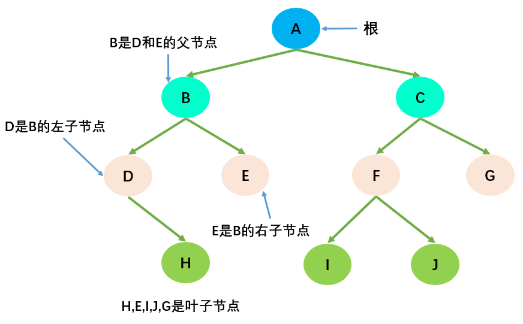

# 二叉搜索树

## 一. 树的概念

### 树是什么?

* 真实的树：
  * 树通常有一个根. 连接着根的是树干.
  * 树干到上面之后会进行分叉成树枝, 树枝还会分叉成更小的树枝.
  * 在树枝的最后是叶子.
* 抽象出来的树结构：


### 树的优点

* 数组:
  * 优点:
    * 数组的主要优点是根据下标值访问效率会很高.
    * 但是如果我们希望根据元素来查找对应的位置呢?
    * 比较好的方式是先对数组进行排序, 再进行二分查找.
  * 缺点:
    * 需要先对数组进行排序, 生成有序数组, 才能提高查找效率.
    * 另外数组在插入和删除数据时, 需要有大量的位移操作(插入到首位或者中间位置的时候), 效率很低.
* 链表:
  * 优点:
    * 链表的插入和删除操作效率都很高.
  * 缺点:
    * 查找效率很低, 需要从头开始依次访问链表中的每个数据项, 直到找到.
    * 而且即使插入和删除操作效率很高, 但是如果要插入和删除中间位置的数据, 还是需要重头先找到对应的数据.
* 哈希表:
  * 优点:
    * 哈希表的插入/查询/删除效率都是非常高的
  * 缺点:
    * 空间利用率不高, 底层使用的是数组, 并且某些单元是没有被利用的.
    * 哈希表中的元素是无序的, 不能按照固定的顺序来遍历哈希表中的元素.
    * 不能快速的找出哈希表中的最大值或者最小值这些特殊的值.
* 树结构:
  * 树综合了上面的数据结构的优点(当然优点不足于盖过其他数据结构, 比如效率一般情况下没有哈希表高), 并且也弥补了上面数据结构的缺点.
  * 为了模拟某些场景, 使用树结构会更加方便. 比如文件的目录结构.

### 树的术语

* 树的定义:

  * 树（Tree）: n（n≥0）个结点构成的有限集合。
    * 当n=0时，称为空树；
    * 对于任一棵非空树（n> 0），它具备以下性质：
    * 树中有一个称为“根（Root）”的特殊结点，用 r 表示；
    * 其余结点可分为m(m>0)个互不相交的有限集T1，T2，... ，Tm，其中每个集合本身又是一棵树，称为原来树的“子树（SubTree）”
  * 注意:
    * 子树之间不可以相交
    * 除了根结点外，每个结点有且仅有一个父结点；
    * 一棵N个结点的树有N-1条边。



* 树的术语:

  * 结点的度（Degree）：结点的子树个数.
  * 树的度：树的所有结点中最大的度数. (树的度通常为结点的个数N-1)
  * 叶结点（Leaf）：度为0的结点. (也称为叶子结点)
  * 父结点（Parent）：有子树的结点是其子树的根结点的父结点
  * 子结点（Child）：若A结点是B结点的父结点，则称B结点是A结点的子结点；子结点也称孩子结点。
  * 兄弟结点（Sibling）：具有同一父结点的各结点彼此是兄弟结点。
  * 路径和路径长度：从结点n1到nk的路径为一个结点序列n1 , n2,… , nk, ni是 ni+1的父结点。路径所包含边的个数为路径的长度。
  * 结点的层次（Level）：规定根结点在1层，其它任一结点的层数是其父结点的层数加1。
  * 树的深度（Depth）：树中所有结点中的最大层次是这棵树的深度。

### 树的表示

* 最普通的表示方式:


* 儿子-兄弟表示法


* 儿子-兄弟表示法旋转


* 其实所有的树本质上都可以使用二叉树模拟出来.

## 二. 二叉树

> 如果树中每个节点最多只能有两个子节点, 这样的树就成为"二叉树".

### 二叉树的概念

* 二叉树的定义

  * 二叉树可以为空, 也就是没有结点.
  * 若不为空，则它是由根结点和其左子树TL以及右子树TR的两个不相交的二叉树组成。
* 二叉树有五种形态:


### 二叉树的特性

* 一个二叉树第 i 层的最大结点数为：2^(i-1)^, i >= 1;

* 深度为k的二叉树有最大结点总数为： 2^k^ - 1, k >= 1;

* 对任何非空二叉树 T，若n0表示叶结点的个数、n2是度为2的非叶结点个数，那么两者满足关系n0 = n2 + 1。


### 特殊的二叉树

* 完美二叉树(Perfect Binary Tree) , 也称为满二叉树(Full Binary Tree）

  * 在二叉树中, 除了最下一层的叶结点外, 每层节点都有2个子结点, 就构成了满二叉树.


* 完全二叉树(Complete Binary Tree)

  * 除二叉树最后一层外, 其他各层的节点数都达到最大个数; 且最后一层从左向右的叶结点连续存在, 只缺右侧若干节点.
  * 完美二叉树是特殊的完全二叉树.
* 下面不是完全二叉树, 因为D节点还没有右结点, 但是E节点就有了左右节点.


### 二叉树的存储

* 二叉树的存储常见的方式是数组和链表.

#### 数组存储

* 完全二叉树: 按从上至下、从左到右顺序存储


* 非完全二叉树:
  * 非完全二叉树要转成完全二叉树才可以按照上面的方案存储.
  * 但是会造成很大的空间浪费


#### 链表存储

* 二叉树最常见的方式还是使用链表存储.
* 每个结点封装成一个Node, Node中包含存储的数据, 左结点的引用, 右结点的引用.


## 三. 二叉搜索树的概念

### 什么是二叉搜索树?

* 二叉搜索树（BST，Binary Search Tree），也称二叉排序树或二叉查找树

* 二叉搜索树是一颗二叉树, 可以为空；如果不为空，满足以下性质：

  * 非空左子树的所有键值小于其根结点的键值。
  * 非空右子树的所有键值大于其根结点的键值。
  * 左、右子树本身也都是二叉搜索树。
* 下面哪些是二叉搜索树, 哪些不是?


* 二叉搜索树的特点:

  * 二叉搜索树的特点就是相对较小的值总是保存在左结点上, 相对较大的值总是保存在右结点上.
  * 查找效率非常高, 这也是二叉搜索树中, "搜索"的来源.

### 二叉搜索树的操作

* `insert(key)`：向树中插入一个新的键。
* `search(key)`：在树中查找一个键，如果结点存在，则返回`true`；如果不存在，则返回`false`。
* `inOrderTraverse`：通过中序遍历方式遍历所有结点。
* `preOrderTraverse`：通过先序遍历方式遍历所有结点。
* `postOrderTraverse`：通过后序遍历方式遍历所有结点。
* `min`：返回树中最小的值/键。
* `max`：返回树中最大的值/键。
* `remove(key)`：从树中移除某个键。

## 四. 二叉搜索树的实现

### 创建二叉搜索树

``` javascript
// 创建BinarySearchTree
function BinarySerachTree() {
    // 创建结点构造函数
    function Node(key) {
        this.key = key
        this.left = null
        this.right = null
    }
    
    // 保存根的属性
    this.root = null
    
    // 二叉搜索树相关的操作方法
}
```

* 代码解析:
  * 封装BinarySearchTree的构造函数.
  * 还需要封装一个用于保存每一个结点的类Node.
    * 该类包含三个属性: 结点对应的key, 指向的左子树, 指向的右子树
  * 对于BinarySearchTree来说, 只需要保存根结点即可, 因为其他结点都可以通过根结点找到.

### 插入数据

* 外界调用的insert方法

``` javascript
// 向树中插入数据
BinarySerachTree.prototype.insert = function (key) {
    // 1.根据key创建对应的node
    var newNode = new Node(key)
    
    // 2.判断根结点是否有值
    if (this.root === null) {
        this.root = newNode
    } else {
        this.insertNode(this.root, newNode)
    }
}
```

* 代码解析:

  * 首先, 根据传入的key, 创建对应的Node.
  * 其次, 向树中插入数据需要分成两种情况:
    * 第一次插入, 直接修改根结点即可.
    * 其他次插入, 需要进行相关的比较决定插入的位置.
  * 在代码中的insertNode方法, 我们还没有实现, 也是我们接下来要完成的任务.
* 插入非根结点

``` javascript
BinarySerachTree.prototype.insertNode = function (node,newNode) {
    if (newNode.key < node.key) { // 1.准备向左子树插入数据
        if (node.left === null) { // 1.1.node的左子树上没有内容
            node.left = newNode
        } else { // 1.2.node的左子树上已经有了内容
            this.insertNode(node.left, newNode)
        }
    } else { // 2.准备向右子树插入数据
        if (node.right === null) { // 2.1.node的右子树上没有内容
            node.right = newNode
        } else { // 2.2.node的右子树上有内容
            this.insertNode(node.right, newNode)
        }
    }
}
```

* 代码解析:

  * 插入其他节点时, 我们需要判断该值到底是插入到左边还是插入到右边.
  * 判断的依据来自于新节点的key和原来节点的key值的比较.
    * 如果新节点的newKey小于原节点的oldKey, 那么就向左边插入.
    * 如果新节点的newKey大于原节点的oldKey, 那么就向右边插入.
  * 代码的1序号位置, 就是准备向左子树插入数据. 但是它本身又分成两种情况
    * 情况一(代码1.1位置): 左子树上原来没有内容, 那么直接插入即可.
    * 情况二(代码1.2位置): 左子树上已经有了内容, 那么就一次向下继续查找新的走向, 所以使用递归调用即可.
  * 代码的2序号位置, 和1序号位置几乎逻辑是相同的, 只是是向右去查找.
    * 情况一(代码2.1位置): 左右树上原来没有内容, 那么直接插入即可.
    * 情况二(代码2.2位置): 右子树上已经有了内容, 那么就一次向下继续查找新的走向, 所以使用递归调用即可.
* 测试代码:

    ``` javascript
    // 测试代码
    var bst = new BinarySerachTree()
    
    // 插入数据
    bst.insert(11)
    bst.insert(7)
    bst.insert(15)
    bst.insert(5)
    bst.insert(3)
    bst.insert(9)
    bst.insert(8)
    bst.insert(10)
    bst.insert(13)
    bst.insert(12)
    bst.insert(14)
    bst.insert(20)
    bst.insert(18)
    bst.insert(25)
    ```

### 遍历二叉树

* 树的遍历:
  * 遍历一棵树是指访问树的每个结点(也可以对每个结点进行某些操作, 我们这里就是简单的打印)
  * 二叉树的遍历常见的有三种方式: 先序遍历/中序遍历/后续遍历. (还有层序遍历, 使用较少, 可以使用队列来完成)

#### 先序遍历

* 遍历过程为：

  * ①访问根结点；
  * ②先序遍历其左子树；
  * ③先序遍历其右子树。
* 遍历过程:


* 遍历的代码实现

``` javascript
BinarySerachTree.prototype.preOrderTraversal = function(handler) {
    this.preOrderTranversalNode(this.root, handler)
}

BinarySerachTree.prototype.preOrderTranversalNode = function(node, handler) {
    if (node !== null) {
        // 1.打印当前经过的节点
        handler(node.key)
        // 2.遍历所有的左子树
        this.preOrderTranversalNode(node.left, handler)
        // 3.遍历所有的右子树
        this.preOrderTranversalNode(node.right, handler)
    }
}
```

* 测试代码:

    ``` javascript
    // 测试前序遍历结果
    var resultString = ""
    bst.preOrderTraversal(function (key) {
        resultString += key + " "
    })
    alert(resultString) // 11 7 5 3 6 9 8 10 15 13 12 14 20 18 25
    ```

* 先序遍历图解


#### 中序遍历

* 遍历过程为:

  * ①中序遍历其左子树；
  * ②访问根结点；
  * ③中序遍历其右子树。
* 遍历过程:


* 遍历的代码实现:

``` javascript
// 中序遍历
BinarySerachTree.prototype.inOrderTraversal = function(handler) {
    this.inOrderTraversalNode(this.root, handler)
}

BinarySerachTree.prototype.inOrderTraversalNode = function(node, handler) {
    if (node !== null) {
        this.inOrderTraversalNode(node.left, handler)
        handler(node.key)
        this.inOrderTraversalNode(node.right, handler)
    }
}
```

* 测试代码:

    ``` javascript
    // 测试中序遍历结果
    resultString = ""
    bst.inOrderTraversal(function (key) {
        resultString += key + " "
    })
    alert(resultString) // 3 5 6 7 8 9 10 11 12 13 14 15 18 20 25 
    ```

* 中序遍历图解:


#### 后序遍历

* 遍历过程为：

  * ①后序遍历其左子树；
  * ②后序遍历其右子树；
  * ③访问根结点。
* 遍历过程:


* 遍历的代码实现:

``` javascript
// 后续遍历
BinarySerachTree.prototype.postOrderTraversal = function(handler) {
    
}

BinarySerachTree.prototype.postOrderTraversalNode = function(node, handler) {
    if (node !== null) {
        this.postOrderTraversalNode(node.left, handler)
        this.postOrderTraversalNode(node.right, handler)
        handler(node.key)
    }
}
```

* 测试代码:

    ``` javascript
    // 测试后续遍历结果
    resultString = ""
    bst.postOrderTraversal(function (key) {
        resultString += key + " "
    })
    alert(resultString) // 3 6 5 8 10 9 7 12 14 13 18 25 20 15 11 
    ```

* 后续遍历图解:


### 最大值&最小值


* 获取最大值&最小值:

``` javascript
// 获取最大值和最小值
BinarySerachTree.prototype.min = function () {
    var node = this.root
    while (node.left !== null) {
        node = node.left
    }
    return node.key
}

BinarySerachTree.prototype.max = function () {
    var node = this.root
    while (node.right !== null) {
        node = node.right
    }
    return node.key
}
```

* 代码解析:
  * 依次向左找到最左边的结点就是最小值,
  * 依次向右找到最右边的结点就是最大值.
* 代码测试:

    ``` javascript
    // 获取最值
    alert(bst.min()) // 3
    alert(bst.max()) // 25
    ```

### 搜索特定的值

* 递归实现：

``` javascript
// 搜搜特定的值
BinarySerachTree.prototype.search = function (key) {
    return this.searchNode(this.root, key)
}

BinarySerachTree.prototype.searchNode = function (node, key) {
    // 1.如果传入的node为null那么, 那么就退出递归
    if (node === null) {
        return false
    }

    // 2.判断node节点的值和传入的key大小
    if (node.key > key) { // 2.1.传入的key较小, 向左边继续查找
        return this.searchNode(node.left, key)
    } else if (node.key < key) { // 2.2.传入的key较大, 向右边继续查找
        return this.searchNode(node.right, key)
    } else { // 2.3.相同, 说明找到了key
        return true
    }
}
```

* 代码解析:

  * 这里我们还是使用了递归的方式. 待会儿我们来写一个非递归的实现.
  * 递归必须有退出条件, 我们这里是两种情况下退出.
    * node === null, 也就是后面不再有节点的时候.
    * 找到对应的key, 也就是node.key === key的时候.
  * 在其他情况下, 根据node.的key和传入的key进行比较来决定向左还是向右查找.
    * 如果node.key > key, 那么说明传入的值更小, 需要向左查找.
    * 如果node.key < key, 那么说明传入的值更大, 需要向右查找.
* 测试代码:

    ``` javascript
    // 查找特定的值
    alert(bst.search(10)) // true
    alert(bst.search(21)) // false
    ```

* 非递归代码实现:

``` javascript
BinarySerachTree.prototype.search = function (key) {
    var node = this.root
    while (node !== null) {
        if (node.key > key) {
            node = node.left
        } else if (node.key < key) {
            node = node.right
        } else {
            return true
        }
    }
    return false
}
```

* 递归or循环?

  * 其实递归和循环之间可以相互转换.
  * 大多数情况下, 递归调用可以简化代码, 但是也会增加空间的复杂度.
  * 循环空间复杂度较低, 但是代码会相对复杂.

## 五. 二叉搜索树的删除

### 删除节点的思路

* 删除节点要从查找待删的节点开始, 找到节点后, 需要考虑三种情况:

  * 该节点是叶子结点(没有子节点, 比较简单)
  * 该节点有一个子节点(也相对简单)
  * 该节点有两个子节点.(情况比较复杂, 我们后面慢慢道来)
* 我们先从查找要删除的节点入手

``` javascript
// 删除结点
BinarySerachTree.prototype.remove = function (key) {
    // 1.定义临时保存的变量
    var current = this.root
    var parent = this.root
    var isLeftChild = true

    // 2.开始查找节点
    while (current.key !== key) {
        parent = current
        if (key < current.key) {
            isLeftChild = true
            current = current.left
        } else {
            isLeftChild = false
            current = current.right
        }

        // 如果发现current已经指向null, 那么说明没有找到要删除的数据
        if (current === null) return false
    }

    return true
}
```

* 代码解析:

  * 在上面的代码序号1位置中, 我们先保存了一些临时变量.
    * current: 用于一会儿找到的要删除的节点对应的node.
    * parent: 用于保存current节点的父节点. 因为如果current有子节点, 那么在删除current节点的时候, 必然需要将parent的left或者right指向它的某一个子节点. 所以需要保存起来current的parent. (树中的节点关系不能向上的, 和链表非常相似)
    * isLeftChild: boolean类型,它用户记录我们是在current是在父节点的左侧还是右侧, 以便到时候设置parent的left或者right
  * 在上面的代码序号2位置中, 开始查找对应的key.
    * 还是之前的思路, 依次向下找到节点, 同时记录current/parent/isLeftChild这些变量
    * 如果遍历到current === null, 那么说明在二叉搜索树中没有该key, 直接返回false即可.
    * 如果找到, 后面就需要我们进一步考虑更加复杂的情况了.

### 情况一: 没有子节点

这种情况相对比较简单, 我们需要检测current的left以及right是否都为null.

* 都为null之后还要检测一个东西, 就是是否current就是根, 都为null, 并且为根, 那么相当于要清空二叉树(当然, 只是清空了根, 因为只有它).
* 否则就把父节点的left或者right字段设置为null即可.

代码实现如下:

``` javascript
// 3.删除的结点是叶结点
if (current.left === null && current.right === null) {
    if (current == this.root) {
        this.root == null
    } else if (isLeftChild) {
        parent.left = null
    } else {
        parent.right = null
    }
}
```

代码解析:

* 首先, 判断是否是叶结点. 通过current的left&right是否为null
* 上面条件成立, 再判断current是否是根结点: 回答是, 那么就将this.root = null即可.
* 如果不是根, 再判断是左结点, 还是右结点, 以便于将parent的left或者right设置为null

### 情况二: 一个子节点

* 要删除的current结点, 只有2个连接(如果有两个子结点, 就是三个连接了), 一个连接父节点, 一个连接唯一的子节点.
* 需要从这三者之间: 爷爷 - 自己 - 儿子, 将自己(current)剪断, 让爷爷直接连接儿子即可.
* 这个过程要求改变父节点的left或者right, 指向要删除节点的子节点.
* 当然, 在这个过程中还要考虑是否current就是根.

代码实现如下:

``` javascript
// 4.删除有一个子节点的节点
else if (current.right === null) {
    if (current == this.root) {
        this.root = current.left
    } else if (isLeftChild) {
        parent.left = current.left
    } else {
        parent.right = current.left
    }
} else if (current.left === null) {
    if (current == this.root) {
        this.root = current.right
    } else if (isLeftChild) {
        parent.left = current.right
    } else {
        parent.right = current.right
    }
}
```

代码解析:

* 首先, 我们需要判断是current的left还是right为null. 因为这样才能决定, 只有我们从current中取儿子的时候, 取的是current.left还是current.right来给别的地方赋值.
* 三种情况:
  * current是根节点, 那么直接将this.root = son.
  * current不是根节点, 是父节点的left节点, 那么parent.left = son.
  * current不是根节点, 是父节点的right节点, 那么parent.right = son.

### 情况三: 两个子节点

* 先来思考一下如下问题:


删除有两个节点的规律:

* 如果我们要删除的节点有两个子节点, 甚至子节点还有子节点, 这种情况下我们需要从下面的子节点中找到一个最接近current节点的节点, 来替换当前的节点.
* 前驱&后继
  * current左子树的最大值, 称为current节点的前驱.
  * current右子树的最小值, 称为current节点的后继.
* 为了能够删除有两个子节点的current, 要么找到它的前驱, 要么找到它的后继, 这里以找后继为例

* 寻找后继的代码实现:

``` javascript
// 找后继的方法
BinarySerachTree.prototype.getSuccessor = function (delNode) {
    // 1.使用变量保存临时的节点
    var successorParent = delNode
    var successor = delNode
    var current = delNode.right // 要从右子树开始找

    // 2.寻找节点
    while (current != null) {
        successorParent = successor
        successor = current
        current = current.left
    }

    // 3.如果是删除图中15的情况, 还需要如下代码
    if (successor != delNode.right) {
        successorParent.left = successor.right
        successor.right = delNode.right
    }
    
    return successor
}
```

* 序号3的代码, 相对较难理解, 这里先不做讨论, 先把找到后继后进行的操作写完, 再后头理解这段代码.

* 找到后继后的处理代码:

``` javascript
// 5.删除有两个节点的节点
else {
    // 1.获取后继节点
    var successor = this.getSuccessor(current)
    
    // 2.判断是否是根节点
    if (current == this.root) {
        this.root = successor
    } else if (isLeftChild) {
        parent.left = successor
    } else {
        parent.right = successor
    }
    
    // 3.将删除节点的左子树赋值给successor
    successor.left = current.left
}
```

* 代码解析:

  * 序号1: 调用刚才封装的方法, 获取后继节点.
  * 序号2: 判断三种情况:
    * 情况一: 是根节点, 那么this.root = successor. 并且successor的left应该等于current的left
    * 情况二: 是父节点的左结点, parent.left = successor, 并且successor的left应该等于current的left
    * 情况三: 是父节点的右结点, parent.right = successor, 并且successor的left应该等于current的left
  * 序号3: 就是将successor.left = current.left从判断中抽取出来.

* 回头看看删除图中15的情况：

  * 上面的代码实现, 对于删除9是适用的. 做法就是将7节点的left 赋值为 10. 10节点的left应该赋值为8即可.
  * 但是, 对于删除15我们还缺少什么呢?
    * 已经完成: 11的left指向了18, 18的right指向了13.
    * 没有完成: 19怎么办? 20这个左子树怎么办?
    * 很明显, 19应该放在20的左边, 20应该放在18的右边.
    * 19放在20的左边代码: successorParent.left = successor.right
    * 20放在18的右边代码: successor.right = delNode.right

### 删除节点完整代码

``` javascript
// 删除结点
BinarySerachTree.prototype.remove = function (key) {
    // 1.定义临时保存的变量
    var current = this.root
    var parent = this.root
    var isLeftChild = true

    // 2.开始查找节点
    while (current.key !== key) {
        parent = current
        if (key < current.key) {
            isLeftChild = true
            current = current.left
        } else {
            isLeftChild = false
            current = current.right
        }

        // 如果发现current已经指向null, 那么说明没有找到要删除的数据
        if (current === null) return false
    }

    // 3.删除的结点是叶结点
    if (current.left === null && current.right === null) {
        if (current == this.root) {
            this.root == null
        } else if (isLeftChild) {
            parent.left = null
        } else {
            parent.right = null
        }
    }

    // 4.删除有一个子节点的节点
    else if (current.right === null) {
        if (current == this.root) {
            this.root = current.left
        } else if (isLeftChild) {
            parent.left = current.left
        } else {
            parent.right = current.left
        }
    } else if (current.left === null) {
        if (current == this.root) {
            this.root = current.right
        } else if (isLeftChild) {
            parent.left = current.right
        } else {
            parent.right = current.right
        }
    }

    // 5.删除有两个节点的节点
    else {
        // 1.获取后继节点
        var successor = this.getSuccessor(current)

        // 2.判断是否是根节点
        if (current == this.root) {
            this.root = successor
        } else if (isLeftChild) {
            parent.left = successor
        } else {
            parent.right = successor
        }

        // 3.将删除节点的左子树赋值给successor
        successor.left = current.left
    }

    return true
}

// 找后继的方法
BinarySerachTree.prototype.getSuccessor = function (delNode) {
    // 1.使用变量保存临时的节点
    var successorParent = delNode
    var successor = delNode
    var current = delNode.right // 要从右子树开始找

    // 2.寻找节点
    while (current != null) {
        successorParent = successor
        successor = current
        current = current.left
    }

    // 3.如果是删除图中15的情况, 还需要如下代码
    if (successor != delNode.right) {
        successorParent.left = successor.right
        successor.right = delNode.right
    }
    
    return successor
}
```

## 六. 完整代码

``` javascript
// 创建BinarySearchTree
function BinarySerachTree() {
    // 创建节点构造函数
    function Node(key) {
        this.key = key
        this.left = null
        this.right = null
    }

    // 保存根的属性
    this.root = null

    // 二叉搜索树相关的操作方法
    // 向树中插入数据
    BinarySerachTree.prototype.insert = function (key) {
        // 1.根据key创建对应的node
        var newNode = new Node(key)

        // 2.判断根节点是否有值
        if (this.root === null) {
            this.root = newNode
        } else {
            this.insertNode(this.root, newNode)
        }
    }

    BinarySerachTree.prototype.insertNode = function (node, newNode) {
        if (newNode.key < node.key) { // 1.准备向左子树插入数据
            if (node.left === null) { // 1.1.node的左子树上没有内容
                node.left = newNode
            } else { // 1.2.node的左子树上已经有了内容
                this.insertNode(node.left, newNode)
            }
        } else { // 2.准备向右子树插入数据
            if (node.right === null) { // 2.1.node的右子树上没有内容
                node.right = newNode
            } else { // 2.2.node的右子树上有内容
                this.insertNode(node.right, newNode)
            }
        }
    }

    // 获取最大值和最小值
    BinarySerachTree.prototype.min = function () {
        var node = this.root
        while (node.left !== null) {
            node = node.left
        }
        return node.key
    }

    BinarySerachTree.prototype.max = function () {
        var node = this.root
        while (node.right !== null) {
            node = node.right
        }
        return node.key
    }

    // 搜搜特定的值
    /*
    BinarySerachTree.prototype.search = function (key) {
        return this.searchNode(this.root, key)
    }

    BinarySerachTree.prototype.searchNode = function (node, key) {
        // 1.如果传入的node为null那么, 那么就退出递归
        if (node === null) {
            return false
        }

        // 2.判断node节点的值和传入的key大小
        if (node.key > key) { // 2.1.传入的key较小, 向左边继续查找
            return this.searchNode(node.left, key)
        } else if (node.key < key) { // 2.2.传入的key较大, 向右边继续查找
            return this.searchNode(node.right, key)
        } else { // 2.3.相同, 说明找到了key
            return true
        }
    }
    */
    BinarySerachTree.prototype.search = function (key) {
        var node = this.root
        while (node !== null) {
            if (node.key > key) {
                node = node.left
            } else if (node.key < key) {
                node = node.right
            } else {
                return true
            }
        }
        return false
    }

    // 删除节点
    BinarySerachTree.prototype.remove = function (key) {
        // 1.获取当前的node
        var node = this.root
        var parent = null

        // 2.循环遍历node
        while (node) {
            if (node.key > key) {
                parent = node
                node = node.left
            } else if (node.key < key) {
                parent = node
                node = node.right
            } else {
                if (node.left == null && node.right == null) {

                }
            }
        }
    }

    BinarySerachTree.prototype.removeNode = function (node, key) {
        // 1.如果传入的node为null, 直接退出递归.
        if (node === null) return null

        // 2.判断key和对应node.key的大小
        if (node.key > key) {
            node.left = this.removeNode(node.left, key)

        }
    }

    // 删除结点
    BinarySerachTree.prototype.remove = function (key) {
        // 1.定义临时保存的变量
        var current = this.root
        var parent = this.root
        var isLeftChild = true

        // 2.开始查找节点
        while (current.key !== key) {
            parent = current
            if (key < current.key) {
                isLeftChild = true
                current = current.left
            } else {
                isLeftChild = false
                current = current.right
            }

            // 如果发现current已经指向null, 那么说明没有找到要删除的数据
            if (current === null) return false
        }

        // 3.删除的结点是叶结点
        if (current.left === null && current.right === null) {
            if (current == this.root) {
                this.root == null
            } else if (isLeftChild) {
                parent.left = null
            } else {
                parent.right = null
            }
        }

        // 4.删除有一个子节点的节点
        else if (current.right === null) {
            if (current == this.root) {
                this.root = current.left
            } else if (isLeftChild) {
                parent.left = current.left
            } else {
                parent.right = current.left
            }
        } else if (current.left === null) {
            if (current == this.root) {
                this.root = current.right
            } else if (isLeftChild) {
                parent.left = current.right
            } else {
                parent.right = current.right
            }
        }

        // 5.删除有两个节点的节点
        else {
            // 1.获取后继节点
            var successor = this.getSuccessor(current)

            // 2.判断是否是根节点
            if (current == this.root) {
                this.root = successor
            } else if (isLeftChild) {
                parent.left = successor
            } else {
                parent.right = successor
            }

            // 3.将删除节点的左子树赋值给successor
            successor.left = current.left
        }

        return true
    }

    // 找后继的方法
    BinarySerachTree.prototype.getSuccessor = function (delNode) {
        // 1.使用变量保存临时的节点
        var successorParent = delNode
        var successor = delNode
        var current = delNode.right // 要从右子树开始找

        // 2.寻找节点
        while (current != null) {
            successorParent = successor
            successor = current
            current = current.left
        }

        // 3.如果是删除图中15的情况, 还需要如下代码
        if (successor != delNode.right) {
            successorParent.left = successor.right
            successor.right = delNode.right
        }
    }

    // 遍历方法
    // 先序遍历
    BinarySerachTree.prototype.preOrderTraversal = function (handler) {
        this.preOrderTranversalNode(this.root, handler)
    }

    BinarySerachTree.prototype.preOrderTranversalNode = function (node, handler) {
        if (node !== null) {
            handler(node.key)
            this.preOrderTranversalNode(node.left, handler)
            this.preOrderTranversalNode(node.right, handler)
        }
    }

    // 中序遍历
    BinarySerachTree.prototype.inOrderTraversal = function (handler) {
        this.inOrderTraversalNode(this.root, handler)
    }

    BinarySerachTree.prototype.inOrderTraversalNode = function (node, handler) {
        if (node !== null) {
            this.inOrderTraversalNode(node.left, handler)
            handler(node.key)
            this.inOrderTraversalNode(node.right, handler)
        }
    }

    // 后续遍历
    BinarySerachTree.prototype.postOrderTraversal = function (handler) {
        this.postOrderTraversalNode(this.root, handler)
    }

    BinarySerachTree.prototype.postOrderTraversalNode = function (node, handler) {
        if (node !== null) {
            this.postOrderTraversalNode(node.left, handler)
            this.postOrderTraversalNode(node.right, handler)
            handler(node.key)
        }
    }
}
```

## 七. 自平衡树

* 二叉搜索树的优势：可以快速地找到给定关键字的数据项， 并且可以快速地插入和删除数据项。
* 二叉搜索树的缺陷：当插入的数据是有序的数据，就会造成二叉搜索树的深度过大。

### 非平衡树

* 比较好的二叉搜索树，它的数据应该是**左右均匀分布**的；
* 但是插入**连续数据**后，二叉搜索树中的数据分布就变得**不均匀**了，我们称这种树为**非平衡树**；
* 对于一棵**平衡二叉树**来说，插入/查找等操作的效率是**O(logN)**；
* 而对于一棵**非平衡二叉树**来说，相当于编写了一个链表，查找效率变成了**O(N)**;

### 树的平衡性

为了能以 **较快的时间O(logN)** 来操作一棵树，我们需要 **保证树总是平衡** 的：

* 起码大部分是平衡的，此时的时间复杂度也是接近O(logN)的；
* 这就要求树中 **每个节点左边的子孙节点** 的个数，应该尽可能地等于 **右边的子孙节点** 的个数；

### 常见的平衡树

* **AVL树**：是最早的一种平衡树，它通过在每个节点多存储一个额外的数据来保持树的平衡。由于AVL树是平衡树，所以它的时间复杂度也是O(logN)。但是它的整体效率不如红黑树，开发中比较少用。
* **红黑树**：同样通过一些特性来保持树的平衡，时间复杂度也是O(logN)。进行插入/删除等操作时，性能优于AVL树，所以平衡树的应用基本都是红黑树。
