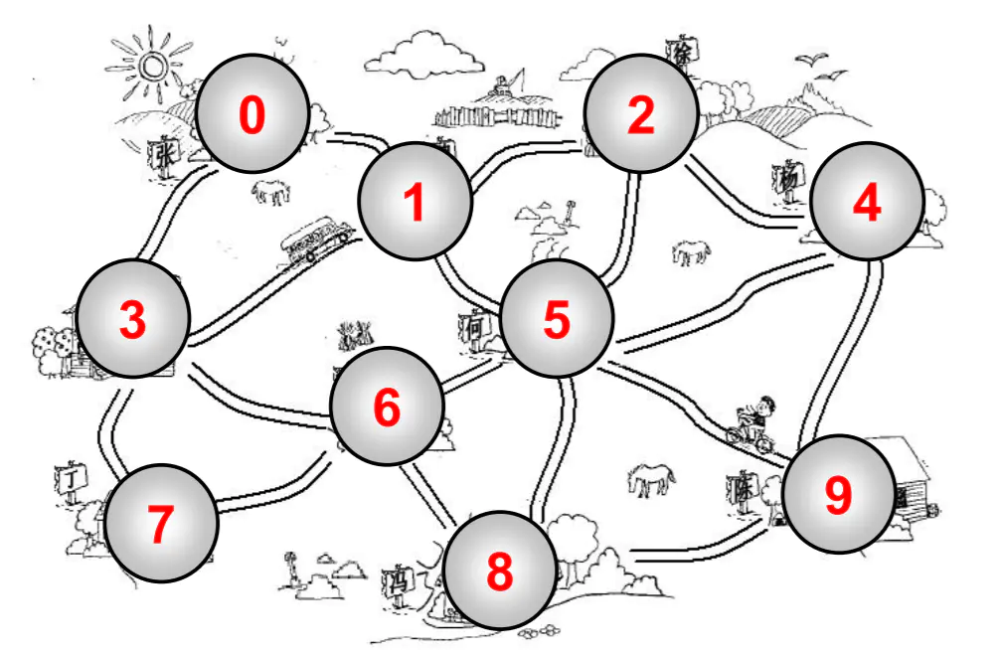
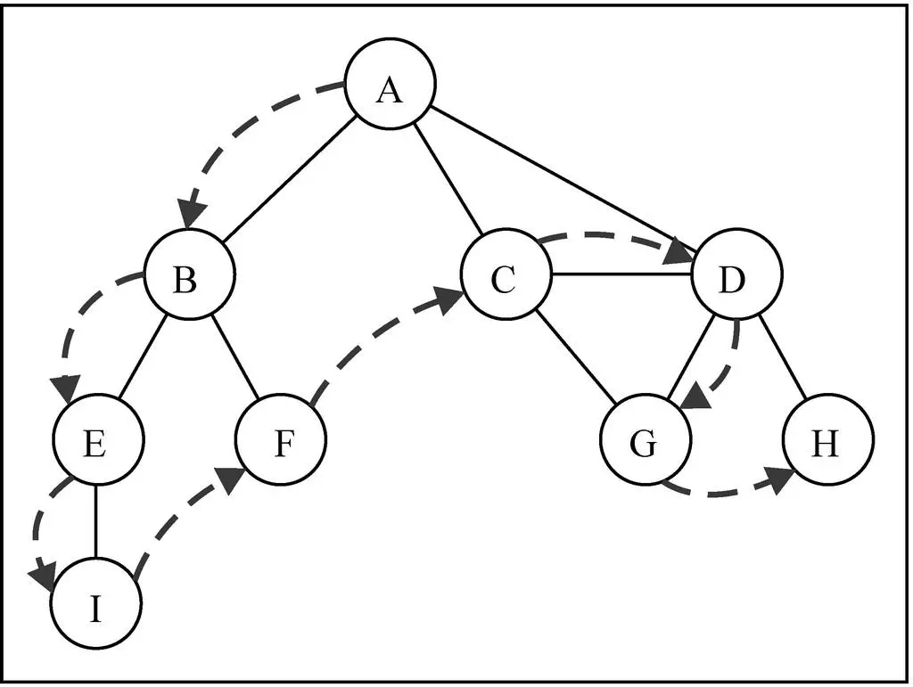

# 图

## 一. 图的概念

在计算机程序设计中，图是一种非常常见的非线性数据结构，图论其实是一个非常大的话题，在数学上起源于哥尼斯堡七桥问题。

### 什么是图?

* 图是一种与树有些相似的数据结构.
  * 图是网络结构的抽象模型。图是一组由边连接的节点（或顶点）。
  * 实际上, 图论是数学的一个分支，并且在数学中，树是图的一种；
  * 图论以图为研究对象，研究顶点和边组成的图形的数学理论和方法；
  * 主要的研究目的为：事物之间的联系，顶点代表事物，边代表两个事物间的关系。

* 图通常有什么特点呢?
  * 一组顶点：通常用 V (Vertex) 表示顶点的集合
  * 一组边：通常用 E (Edge) 表示边的集合
    * 边是顶点和顶点之间的连线
    * 边可以是有向的, 也可以是无向的.(比如A --- B, 通常表示无向. A --> B, 通常表示有向)

### 图的术语



* 顶点:
  * 表示图中的一个结点.
  * 比如地铁站中某个站/多个村庄中的某个村庄/互联网中的某台主机/人际关系中的人.
* 边:
  * 表示顶点和顶点之间的连线.
  * 比如地铁站中两个站点之间的直接连线, 就是一个边.
  * 注意: 这里的边不要叫做路径, 路径有其他的概念, 待会儿我们会介绍到.
  * 比如0 - 1有一条边, 1 - 2有一条边, 0 - 2没有边.
* 相邻顶点
  * 由一条边连接在一起的顶点称为相邻顶点.
  * 比如0 - 1是相邻的, 0 - 3是相邻的. 0 - 2是不相邻的
* 度:
  * 一个顶点的度是相邻顶点的数量.
  * 比如0顶点和其他两个顶点相连, 0顶点的度是2
  * 比如1顶点和其他四个顶点相连, 1顶点的度是4
* 路径:
  * 路径是顶点v1, v2..., vn的一个连续序列, 比如图中0 1 5 9就是一条路径.
  * 简单路径: 简单路径要求不包含重复的顶点. 比如 0 1 5 9是一条简单路径.
  * 回路: 第一个顶点和最后一个顶点相同的路径称为回路. 比如 0 1 5 6 3 0
* 无向图:
  * 上面的图就是一张无向图, 因为所有的边都没有方向.
  * 比如 0 - 1之间有边, 那么说明这条边可以保证 0 -> 1, 也可以保证 1 -> 0.
* 有向图:
  * 有向图表示的图中的边是有方向的.
  * 比如 0 -> 1, 不能保证一定可以 1 -> 0, 要根据方向来定.
* 无权图和带权图
  * 无权图:
    * 上面的图就是一张无权图(边没有携带权重)
    * 上面的图中的边是没有任何意义的, 不能收 0 - 1的边, 比4 - 9的边更远或者用的时间更长.
  * 带权图:
    * 带权图表示边有一定的权重.
    * 这里的权重可以是任意你希望表示的数据: 比如距离或者花费的时间或者票价.

### 现实建模

* 图可用于对现实中很多系统建模
  * 对交通流量建模
    * 顶点可以表示街道的十字路口, 边可以表示街道.
    * 加权的边可以表示限速或者车道的数量或者街道的距离.
    * 建模人员可以用这个系统来判定最佳路线以及最可能堵车的街道.
  * 对飞机航线建模
    * 航空公司可以用图来为其飞行系统建模.
    * 将每个机场看成顶点, 将经过两个顶点的每条航线看作一条边.
    * 加权的边可以表示从一个机场到另一个机场的航班成本, 或两个机场间的距离.
    * 建模人员可以利用这个系统有效的判断从一个城市到另一个城市的最小航行成本.
  * ​

## 二. 图的表示

> 一个图包含很多顶点, 另外包含顶点和顶点之间的连线(边), 这两个都是非常重要的图信息, 因此都需要在程序中体现出来.

### 顶点表示

* 顶点的表示相对简单, 我们先讨论顶点的表示.
  * 上面的顶点, 我们抽象成了1 2 3 4, 也可以抽象成A B C D. 在后面的案例中, 我们使用A B C D.
  * 那么这些A B C D我们可以使用一个数组来存储起来(存储所有的顶点)
  * 当然, A, B, C, D有可能还表示其他含义的数据(比如村庄的名字), 这个时候, 可以另外创建一个数组, 用于存储对应的其他数据.

### 邻接矩阵

* 一种比较常见的表示图的方式: 邻接矩阵.

  * 邻接矩阵让每个节点和一个整数向关联, 该整数作为数组的下标值.
  * 我们用一个二维数组来表示顶点之间的连接.
* 画图演示:


* 图片解析:

  * 在二维数组中, 0表示没有连线, 1表示有连线.
  * 通过二维数组, 我们可以很快的找到一个顶点和哪些顶点有连线.(比如A顶点, 只需要遍历第一行即可)
  * 另外, A - A, B - B(也就是顶点到自己的连线), 通常使用0表示.
* 邻接矩阵的问题:

  * 如果是一个无向图, 邻接矩阵展示出来的二维数组, 其实是一个对称图.
    * 也就是A -> D是1的时候, 对称的位置 D -> 1一定也是1.
    * 那么这种情况下会造成空间的浪费
  * 邻接矩阵还有一个比较严重的问题就是如果图是一个稀疏图
    * 那么矩阵中将存在大量的0, 这意味着我们浪费了计算机存储空间来表示根本不存在的边.
    * 而且即使只有一个边, 我们也必须遍历一行来找出这个边, 也浪费很多时间.

### 邻接表

* 另外一种常用的表示图的方式: 邻接表.

  * 邻接表由图中每个顶点以及和顶点相邻的顶点列表组成.
  * 这个列表有很多中方式来存储: 数组/链表/字典(哈希表)都可以.
* 画图演示:


* 图片解析:

  * 其实图片比较容易理解.
  * 比如我们要表示和A顶点有关联的顶点(边), A和B/C/D有边, 那么我们可以通过A找到对应的数组/链表/字典, 再取出其中的内容就可以啦.
* 邻接表的问题:

  * 邻接表计算"出度"是比较简单的(出度: 指向别人的数量, 入度: 指向自己的数量)
  * 邻接表如果需要计算有向图的"入度", 那么是一件非常麻烦的事情, 它必须构造一个"“逆邻接表", 才能有效的计算"入度". 而邻接矩阵会非常简单.

## 三. 图的封装

### 创建图类

* 我们先来创建Graph类

``` javascript
function Graph() {
    // 属性
    this.vertexes = [] // 存储顶点
    this.adjList = new Dictionay() // 存储边
    
    // 方法
}
```

* 代码解析

  * 创建Graph的构造函数.
  * 定义了两个属性:
    * vertexes: 用于存储所有的顶点, 我们说过使用一个数组来保存.
    * adjList: adj是adjoin的缩写, 邻接的意思. adjList用于存储所有的边, 我们这里采用邻接表的形式.
  * 之后, 我们来定义一些方法以及实现一些算法就是一个完整的图类了.

### 添加方法

* 添加顶点的实现:

``` javascript
// 添加方法
Graph.prototype.addVertex = function (v) {
    this.vertexes.push(v)
    this.adjList.set(v, [])
}
```

* 代码解析:

  * 我们将添加的顶点放入到数组中.
  * 另外, 我们给该顶点创建一个数组\[\], 该数组用于存储顶点连接的所有的边.(回顾邻接表的实现方式)
* 添加边:

``` javascript
Graph.prototype.addEdge = function (v, w) {
    this.adjList.get(v).push(w)
    this.adjList.get(w).push(v)
}
```

* 代码解析:

  * 添加边需要传入两个顶点, 因为边是两个顶点之间的边, 边不可能单独存在.
  * 根据顶点v取出对应的数组, 将w加入到它的数组中.
  * 根据顶点w取出对应的数组, 将v加入到它的数组中.
  * 因为我们这里实现的是无向图, 所以边是可以双向的.

* 添加toString方法，实现以邻接表的形式输出图中各顶点:

``` javascript
Graph.prototype.toString = function () {
    var resultStr = ""
    for (var i = 0; i < this.vertexes.length; i++) {
        resultStr += this.vertexes[i] + "->"
        var adj = this.adjList.get(this.vertexes[i])
        for (var j = 0; j < adj.length; j++) {
            resultStr += adj[j] + " "
        }
        resultStr += "\n"
    }
    return resultStr
}
```

### 测试代码

* 测试

    ``` javascript
    // 测试代码
    var graph = new Graph()
    
    // 添加顶点
    var myVertexes = ["A", "B", "C", "D", "E", "F", "G", "H", "I"]
    for (var i = 0; i < myVertexes.length; i++) {
        graph.addVertex(myVertexes[i])
    }
    
    // 添加边
    graph.addEdge('A', 'B');
    graph.addEdge('A', 'C');
    graph.addEdge('A', 'D');
    graph.addEdge('C', 'D');
    graph.addEdge('C', 'G');
    graph.addEdge('D', 'G');
    graph.addEdge('D', 'H');
    graph.addEdge('B', 'E');
    graph.addEdge('B', 'F');
    graph.addEdge('E', 'I');
    
    // toString
    console.log(graph.toString());
    ```

## 四. 图的遍历

### 遍历的方式

* 图的遍历思想

  * 图的遍历算法的思想在于必须访问每个第一次访问的节点, 并且追踪有哪些顶点还没有被访问到.
* 有两种算法可以对图进行遍历

  * 广度优先搜索(Breadth-First Search, 简称BFS)
  * 深度优先搜索(Depth-First Search, 简称DFS)
  * 两种遍历算法, 都需要明确指定第一个被访问的顶点.
* 遍历的注意点:

  * 完全探索一个顶点要求我们便查看该顶点的每一条边.
  * 对于每一条所连接的没有被访问过的顶点, 将其标注为被发现的, 并将其加进待访问顶点列表中.
  * 为了保证算法的效率: 每个顶点至多访问两次.
* 两种算法的思想:

  * BFS: 基于队列, 入队列的顶点先被探索.
  * DFS: 基于栈, 通过将顶点存入栈中, 顶点是沿着路径被探索的, 存在新的相邻顶点就去访问.
* 为了记录顶点是否被访问过, 我们使用三种颜色来反应它们的状态:(或者两种颜色也可以)

  * 白色: 表示该顶点还没有被访问.
  * 灰色: 表示该顶点被访问过, 但并未被探索过.
  * 黑色: 表示该顶点被访问过且被完全探索过.
* 初始化颜色代码:

``` javascript
// 广度优先算法
Graph.prototype.initializeColor = function () {
    var colors = []
    for (var i = 0; i < this.vertexes.length; i++) {
        colors[this.vertexes[i]] = "white"
    }
    return colors
}
```

### 广度优先搜索

* 广度优先搜索算法的思路:

  * 广度优先算法会从指定的第一个顶点开始遍历图, 先访问其所有的相邻点, 就像一次访问图的一层.
  * 换句话说, 就是先宽后深的访问顶点


* 广度优先搜索的实现:

  * 创建一个队列Q.
  * 将v标注为被发现的(灰色), 并将v将入队列Q
  * 如果Q非空, 执行下面的步骤:
    * 将v从Q中取出队列.
    * 将v标注为被发现的灰色.
    * 将v所有的未被访问过的邻接点(白色), 加入到队列中.
    * 将v标志为黑色.
* 广度优先搜索的代码:

``` javascript
Graph.prototype.bfs = function (v, handler) {
    // 1.初始化颜色
    var color = this.initializeColor()

    // 2.创建队列
    var queue = new Queue()

    // 3.将传入的顶点放入队列中
    queue.enqueue(v)

    // 4.从队列中依次取出和放入数据
    while (!queue.isEmpty()) {
        // 4.1.从队列中取出数据
        var qv = queue.dequeue()

        // 4.2.获取qv相邻的所有顶点
        var qAdj = this.adjList.get(qv)

        // 4.3.将qv的颜色设置成灰色
        color[qv] = "gray"

        // 4.4.将qAdj的所有顶点依次压入队列中
        for (var i = 0; i < qAdj.length; i++) {
            var a = qAdj[i]
            if (color[a] === "white") {
                color[a] = "gray"
                queue.enqueue(a)
            }
        }

        // 4.5.因为qv已经探测完毕, 将qv设置成黑色
        color[qv] = "black"

        // 4.6.处理qv
        if (handler) {
            handler(qv)
        }
    }
}
```

* 代码解析:

  * 代码序号1: 我们先为每个顶点记录一种颜色, 用于保持它当前的状态.
  * 代码序号2: 创建队列, 这里需要用到我们之前封装的队列类型, 因此需要导入.
  * 代码序号3: 将开始的顶点放入队列中.
  * 代码序号4: 开始处理队列中的数据.
    * 4.1.先从队列中取出顶点qv.
    * 4.2.取出该顶点相邻的顶点数组qAdj.
    * 4.3.因为之前的qv已经被探测过, 所有将qv设置为灰色.
    * 4.4.遍历qAdj所有的所有的顶点, 判断颜色, 如果是白色, 那么将其将入到队列中. 并且将该顶点设置为灰色.
    * 4.5.将qv顶点设置为黑色
    * 4.6.处理qv顶点.
* 测试代码:

    ``` javascript
    // 调用广度优先算法
    var result = ""
    graph.bfs(graph.vertexes[0], function (v) {
        result += v + " "
    })
    alert(result) // A B C D E F G H I 
    ```

### 深度优先搜索

* 深度优先搜索的思路:

  * 深度优先搜索算法将会从第一个指定的顶点开始遍历图, 沿着路径知道这条路径最后被访问了.
  * 接着原路回退并探索吓一条路径.



* 深度优先搜索算法的实现:

  * 广度优先搜索算法我们使用的是队列, 这里可以使用栈完成, 也可以使用递归.
  * 方便代码书写, 我们还是使用递归(递归本质上就是函数栈的调用)
* 深度优先搜索算法的实现:

``` javascript
// 深度优先搜索
Graph.prototype.dfs = function (handler) {
    // 1.初始化颜色
    var color = this.initializeColor()

    // 2.遍历所有的顶点, 开始访问
    for (var i = 0; i < this.vertexes.length; i++) {
        if (color[this.vertexes[i]] === "white") {
            this.dfsVisit(this.vertexes[i], color, handler)
        }
    }
}

// dfs的递归调用方法
Graph.prototype.dfsVisit = function (u, color, handler) {
    // 1.将u的颜色设置为灰色
    color[u] = "gray"

    // 2.处理u顶点
    if (handler) {
        handler(u)
    }

    // 3.u的所有邻接顶点的访问
    var uAdj = this.adjList.get(u)
    for (var i = 0; i < uAdj.length; i++) {
        var w = uAdj[i]
        if (color[w] === "white") {
            this.dfsVisit(w, color, handler)
        }
    }

    // 4.将u设置为黑色
    color[u] = "black"
}
```

* 代码解析:

  * 代码序号1: 初始化颜色.和广度优先搜索算法一样.
  * 代码序号2: 遍历所有的顶点, 每遍历一个顶点, 让其执行递归函数.
    * 递归代码1: 探测了u顶点, 所有u顶点的颜色设置为灰色.
    * 递归代码2: 访问u顶点, 通过回调函数传入u.
    * 递归代码3: 访问u顶点的相连的顶点, 在访问的过程中判断该顶点如果为白色, 说明未探测, 调用递归方法.
    * 递归代码4: u被探测过, 也被访问过, 将u的颜色设置为黑色.

* 下面这个示意图展示了该算法每一步的执行过程：


