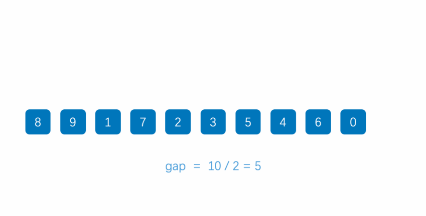

# 排序算法

## 创建列表

* 在开始排序前, 我们先来创建一个列表封装我们的数据项.

``` javascript
// 封装ArrayList
function ArrayList() {
    this.array = []
    //封装将数据插入到数组中方法
    ArrayList.prototype.insert = function (item) {
        this.array.push(item)
    }
    //封装toString方法
    ArrayList.prototype.toString = function () {
        return this.array.join()
    }
    //交换两个位置的数据
    ArrayList.prototype.swap = function(m, n){
      let temp  = this.array[m]
      this.array[m] = this.array[n]
      this.array[n] = temp
    }
}
```

* 初始化数据项

``` javascript
// 初始化数据项
var list = new ArrayList()

list.insert(3)
list.insert(6)
list.insert(4)
list.insert(2)
list.insert(11)
list.insert(10)
list.insert(5)

alert(list)
```

## 一. 冒泡排序


### 冒泡排序的思路

* 冒泡排序的思路:

  * 对未排序的各元素从头到尾依次比较相邻的两个元素大小关系
  * 如果左边元素较大, 则交换两元素位置
  * 向右移动一个位置, 比较后面的两个元素
  * 当走到最右端时, 最大的元素一定被放在了最右边
  * 按照这个思路, 从最左端重新开始, 这次走到倒数第二个位置即可.
  * 依次类推, 就可以将数据排序完成

### 冒泡排序的实现

``` javascript
ArrayList.prototype.bubbleSort = function () {
    // 1.获取数组的长度
    var length = this.array.length

    // 2.反向循环, 因此次数越来越少
    for (var i = length - 1; i >= 0; i--) {
        // 3.根据i的次数, 比较循环到i位置
        for (var j = 0; j < i; j++) {
            // 4.如果j位置比j+1位置的数据大, 那么就交换
            if (this.array[j] > this.array[j+1]) {
                // 交换
                this.swap(j, j+1)
            }
        }
    }
}

ArrayList.prototype.swap = function (m, n) {
    var temp = this.array[m]
    this.array[m] = this.array[n]
    this.array[n] = temp
}
```

* 代码解析:

  * 代码序号1: 获取数组的长度.
  * 代码序号2: 我们现在要写的外层循环, 外层循环应该让i依次减少, 因此我们这里使用了反向的遍历.
  * 代码需要3: 内层循环, 内层循环我们使用 j < i. 因为上面的i在不断减小, 这样就可以控制内层循环的次数.
  * 代码需要4: 比较两个数据项的大小, 如果前面的大, 那么就进行交换.

* 测试代码:

    ``` javascript
    // 测试冒泡排序
    list.bubbleSort()
    alert(list) // 2,3,4,5,6,10,11
    ```

### 冒泡排序的效率

* 冒泡排序的比较次数:
  * 按照上面的例子来说, 一共有7个数字, 第一次循环6次比较, 第二次5次比较, 第三次4次比较....直到最后一趟进行了一次比较.
  * 对于7个数据项比较次数: 6 + 5 + 4 + 3 + 2 + 1
  * 对于N个数据项呢? (N - 1) + (N - 2) + (N - 3) + ... + 1 = N \* (N - 1) / 2
* 大O表示法:
  * 大O表示法是描述性能和复杂度的一种表示方法.
  * 推导大O表示法通常我们会使用如下规则:
    * 用常量1取代运行时间中的所有加法常量
    * 在修改后的运行次数函数中, 只保留最高阶项
    * 如果最高阶项存在并且不是1, 则去除与这个项相乘的常数.
* 通过大O表示法推到过程, 我们来推到一下冒泡排序的大O形式.
  * N \* (N - 1) / 2 = N²/2 - N/2,根据规则2, 只保留最高阶项, 编程N² / 2
  * N² / 2, 根据规则3, 去除常量, 变成N²
  * 因此冒泡排序的大O表示法为O(N²)
* 冒泡排序的交换次数:
  * 冒泡排序的交换次数是多少呢?
  * 如果有两次比较才需要交换一次(不可能每次比较都交换一次.), 那么交换次数为N² / 4
  * 由于常量不算在大O表示法中, 因此, 我们可以认为交换次数的大O表示也是O(N²)

## 二. 选择排序


### 选择排序的思路

* 选择排序的思路:

  * 选定第一个索引位置，然后和后面元素依次比较
  * 如果后面的元素中的最小元素小于第一个索引位置的元素, 则交换位置
  * 然后从第二个索引位置开始，使用同样的方法把剩下的元素逐个比较即可

### 选择排序的实现

``` javascript
ArrayList.prototype.selectionSort = function () {
    // 1.获取数组的长度
    var length = this.array.length

    // 2.外层循环: 从0位置开始取出数据, 直到length-2位置
    for (var i = 0; i < length - 1; i++) {
        // 3.内层循环: 从i+1位置开始, 和后面的内容比较
        var min = i
        for (var j = min + 1; j < length; j++) {
            // 4.如果i位置的数据大于j位置的数据, 那么记录最小的位置
            if (this.array[min] > this.array[j]) {
                min = j
            }
        }
        // 5.交换min和i位置的数据
        this.swap(min, i)
    }
}
```

* 代码解析:

  * 代码序号1: 依然获取数组的长度.
  * 代码序号2: 外层循环, 我们已经讲过, 需要从外层循环的第0个位置开始, 依次遍历到length - 2的位置.
  * 代码序号3: 先定义一个min, 用于记录最小的位置, 内层循环, 内层循环是从i+1位置开始的数据项, 和i位置的数据项依次比较, 直到length-1的数据项.
  * 代码序号4: 如果比较的位置i的数据项, 大于后面某一个数据项, 那么记录最小位置的数据.
  * 代码序号5: 将min位置的数据, 那么i位置的数据交换, 那么i位置就是正确的数据了.
  * 注意: 这里的交换是基于之前的交换方法, 这里直接调用即可.

* 测试代码:

    ``` javascript
    // 测试选择排序
    list.selectionSort()
    alert(list) // 2,3,4,5,6,10,11
    ```

### 选择排序的效率

* 选择排序的比较次数:
  * 选择排序和冒泡排序的比较次数都是N\*(N-1)/2, 也就是O(N²).
* 选择排序的交换次数:
  * 选择排序的交换次数只有N-1次, 用大O表示法就是O(N).
  * 所以选择排序通常认为在执行效率上是高于冒泡排序的.

## 三. 插入排序


### 插入排序的思路

* 将第一个元素看做一个有序序列，把第二个元素到最后一个元素当成是未排序序列
* 取出第二个元素作为待插入元素，在已经排序的元素序列中从后向前扫描
* 如果该元素（已排序）大于待插入元素，将该元素移到下一位置
* 重复上一个步骤，直到找到已排序的元素小于或者等于待插入元素的位置
* 将新元素插入到该位置后, 重复上面的步骤.

### 插入排序的实现

``` javascript
ArrayList.prototype.insertionSort = function () {
    // 1.获取数组的长度
    var length = this.array.length

    // 2.外层循环: 外层循环是从1位置开始, 依次遍历到最后
    for (var i = 1; i < length; i++) {
        // 3.记录选出的元素, 放在变量temp中
        var j = i
        var temp = this.array[i]

        // 4.内层循环: 内层循环不确定循环的次数, 最好使用while循环
        while (j > 0 && this.array[j-1] > temp) {
            this.array[j] = this.array[j-1]
            j--
        }

        // 5.将选出的j位置, 放入temp元素
        this.array[j] = temp
    }
}
```

* 代码解析

  * 代码序号1: 获取数组的长度.
  * 代码序号2: 外层循环, 从1位置开始, 因为0位置可以默认看成是有序的了.
  * 代码序号3: 记录选出的i位置的元素, 保存在变量temp中. i默认等于j
  * 代码序号4: 内层循环
    * 内层循环的判断j - 1位置的元素和temp比较, 并且j > 0.
    * 那么就将j-1位置的元素放在j位置.
    * j位置向前移.
  * 代码序号5: 将目前选出的j位置放置temp元素.

* 测试代码:

    ``` javascript
    // 测试插入排序
    list.insertionSort()
    alert(list) // 2,3,4,5,6,10,11
    ```

### 插入排序的效率

* 插入排序的比较次数:
  * 第一趟时, 需要的最多次数是1, 第二趟最多次数是2, 依次类推, 最后一趟是N-1次.
  * 因此比较次数是1 + 2 + 3 + ... + N - 1 = N \* (N - 1) / 2.
  * 然而每趟发现插入点之前, 平均只有全体数据项的一半需要进行比较.
  * 我们可以除以2得到 N \* (N - 1) / 4. 所以相对于选择排序, 比较次数是少了一半的.
* 插入排序的复制次数:
  * 第一趟时, 需要的最多复制次数是1, 第二趟最多次数是2, 依次类推, 最后一趟是N-1次.
  * 因此是1 + 2 + 3 + ... + N - 1 = N \* (N - 1) / 2.

## 四. 希尔排序



> 希尔排序，也称递减增量排序算法，是插入排序的一种更高效的改进版本。但希尔排序是非稳定排序算法。
>
> 希尔排序是基于插入排序的以下两点性质而提出改进方法的：
>
> * 插入排序在对几乎已经排好序的数据操作时，效率高，即可以达到线性排序的效率；
> * 但插入排序一般来说是低效的，因为插入排序每次只能将数据移动一位；  
>
> 希尔排序的基本思想是：先将整个待排序的记录序列分割成为若干子序列分别进行直接插入排序，待整个序列中的记录"基本有序"时，再对全体记录进行依次直接插入排序。

### 希尔排序的思路

* 插入排序的问题:

  * 假设一个很小的数据项在很靠近右端的位置上, 这里本来应该是较大的数据项的位置.
  * 把这个小数据项移动到左边的正确位置, 所有的中间数据项都必须向右移动一位.
  * 如果每个步骤对数据项都进行N次复制, 平均下来是移动N/2, N个元素就是 N\*N/2 = N²/2.
  * 所以我们通常认为插入排序的效率是O(N²)
  * 如果有某种方式, 不需要一个个移动所有中间的数据项, 就能把较小的数据项移动到左边, 那么这个算法的执行效率就会有很大的改进.
* 希尔排序的做法:

  * 比如下面的数字, 81, 94, 11, 96, 12, 35, 17, 95, 28, 58, 41, 75, 15.
  * 我们先让间隔为5, 进行排序. (81, 35, 41), (94, 17, 75), (11, 95, 15), (96, 28), (12, 58)
  * 排序后的新序列, 一定可以让数字离自己的正确位置更近一步.
  * 我们再让间隔位3, 进行排序. (35, 28, 75, 58, 95), (17, 12, 15, 81), (11, 41, 96, 94)
  * 排序后的新序列, 一定可以让数字离自己的正确位置又近了一步.
  * 最后, 我们让间隔为1, 也就是正确的插入排序. 这个时候数字都离自己的位置更近, 那么需要复制的次数一定会减少很多.


* 选择合适的增量:

  * 在希尔排序的原稿中, 他建议的初始间距是N / 2, 简单的把每趟排序分成两半.
  * 也就是说, 对于N = 100的数组, 增量间隔序列为: 50, 25, 12, 6, 3, 1.
  * 这个方法的好处是不需要在开始排序前为找合适的增量而进行任何的计算.

* 希尔排序的步骤:
  * 选择一个增量序列 t1，t2，……，tk，其中 ti > tj, tk = 1；
  * 按增量序列个数 k，对序列进行 k 趟排序；
  * 每趟排序，根据对应的增量 ti，将待排序列分割成若干长度为 m 的子序列，分别对各子表进行直接插入排序。仅增量因子为 1 时，整个序列作为一个表来处理，表长度即为整个序列的长度。

### 希尔排序的实现

``` javascript
ArrayList.prototype.shellSort = function () {
    // 1.获取数组的长度
    var length = this.array.length

    // 2.根据长度计算增量
    var gap = Math.floor(length / 2)

    // 3.增量不断变量小, 大于0就继续排序
    while (gap > 0) {
        // 4.实现插入排序
        for (var i = gap; i < length; i++) {
            // 4.1.保存临时变量
            var j = i
            var temp = this.array[i]

            // 4.2.插入排序的内层循环
            while (j > gap - 1 && this.array[j - gap] > temp) {
                this.array[j] = this.array[j - gap]
                j -= gap
            }

            // 4.3.将选出的j位置设置为temp
            this.array[j] = temp
        }
      
        // 5.重新计算新的间隔
        gap = Math.floor(gap / 2)
    }
}
```

* 代码解析

  * 代码序号1: 获取数组的长度
  * 代码序号2: 计算第一次的间隔, 我们按照希尔提出的间隔实现.
  * 代码序号3: 增量不断变小, 大于0就继续改变增量
  * 代码序号4: 实际上就是实现了插入排序
    * 代码序号4.1: 保存临时变量, j位置从i开始, 保存该位置的值到变量temp中
    * 代码序号4.2: 内层循环, j > gap - 1并且temp大于this.array[j - gap], 那么就进行复制.
    * 代码序号4.3: 将j位置设置为变量temp
  * 代码序号5: 每次while循环后都重新计算新的间隔.
* 测试代码:

    ``` javascript
    // 测试希尔排序
    list.shellSort()
    alert(list)
    ```

### 希尔排序的效率

* 希尔排序的效率
  * 希尔排序的效率和增量是有关系的.
  * 经过统计, 希尔排序使用原始增量, 最坏的情况下时间复杂度为O(N²), 通常情况下都要好于O(N²)
* 使用希尔排序大多数情况下效率都高于简单排序, 甚至在合适的增量和N的情况下, 还好好于快速排序.

## 五. 快速排序


### 快速排序的思路

* 快速排序是什么?

  * 希尔排序相当于插入排序的升级版, 快速排序其实是我们学习过的最慢的冒泡排序的升级版.
  * 冒泡排序需要经过很多次交换, 才能在一次循环中, 将最大值放在正确的位置.
  * 而快速排序可以在一次循环中(其实是递归调用)找出某个元素的正确位置, 并且该元素之后不需要任何移动.
* 快速排序的思想:

  * 快速排序最重要的思想是分而治之.
  * 比如我们下面有这样一段数字需要排序:
    * 第一步: 从其中选出了65. (其实可以是选出任意的数字, 我们以65举个栗子)
    * 第二步: 我们通过算法: 将所有小于65的数字放在65的左边, 将所有大于65的数字放在65的右边.
    * 第三步: 递归的处理左边的数据.(比如你选择31来处理左侧), 递归的处理右边的数据.(比如选择75来处理右侧, 当然选择81可能更合适)
    * 最终: 排序完成
  * 和冒泡排序不同的是什么呢?
    * 我们选择的65可以一次性将它放在最正确的位置, 之后不需要任何移动.
    * 冒泡排序即使已经找到了最大值, 也需要向右继续移动最大值. 而插入排序对数字的定位是一次性的.


* 快速排序的步骤:
  * 从数列中挑出一个元素，称为 "基准"（pivot）;
  * 重新排序数列，所有元素比基准值小的摆放在基准前面，所有元素比基准值大的摆在基准的后面（相同的数可以到任一边）。在这个分区退出之后，该基准就处于数列的中间位置。这个称为分区（partition）操作；
  * 递归地（recursive）把小于基准值元素的子数列和大于基准值元素的子数列排序；

### 快速排序的实现

#### 方案一

``` javascript
// 快速排序，简单易懂版本
export const quickSort = (array) => {
  // 检查数组的元素个数，如果小于等于1，就返回
  if (array.length <= 1) {
    return array
  }
  // 选择"基准"（pivot），并将其与原数组分离，再定义两个空数组，用来存放一左一右的两个子集
  const pivotIndex = Math.floor(array.length / 2)
  const pivot = array.splice(pivotIndex, 1)[0]
  const left = []
  const right = []
  // 遍历数组，小于"基准"的元素放入左边的子集，大于基准的元素放入右边的子集
  for (let i = 0; i < array.length; i++){
    if (array[i] < pivot) {
      left.push(array[i])
    } else {
      right.push(array[i])
    }
  }
  // 使用递归不断重复这个过程，就可以得到排序后的数组
  return quickSort(left).concat(pivot, quickSort(right))
}
```

* 代码解析:
  * 单独开辟两个存储空间left和right来存储每次递归比pivot小和大的序列
  * 每次递归直接返回left、pivot、right拼接后的数组
  * 浪费大量存储空间，写法简单

#### 方案二

* 选择基准：取头、中、尾的中位数
  * 例如 8、12、3的中位数就是8

``` javascript
// 选择基准
ArrayList.prototype.median = function (left, right) {
    // 1.求出中间的位置
    var center = Math.floor((left + right) / 2)

    // 2.判断并且进行交换
    if (this.array[left] > this.array[center]) {
        this.swap(left, center)
    }
    if (this.array[center] > this.array[right]) {
        this.swap(center, right)
    }
    if (this.array[left] > this.array[right]) {
        this.swap(left, right)
    }

    // 3.巧妙的操作: 将center移动到right - 1的位置.
    this.swap(center, right - 1)

    // 4.返回pivot
    return this.array[right - 1]
}
```

* 代码解析:

  * 我们封装了一个函数, 该函数用于选择出来合适的基准.
  * 该函数要求传入left和right, 这样可以根据left和right求出一个center, 在选择它们三者的中位数.
    * 代码序号1: 根据left/right求出center.
    * 代码序号2: 将left放在最前面, 将center放在中间, 将right放在右边.
    * 代码序号3: 这里有一个巧妙的操作, 我们将pivot值放在了right的紧挨着的左边, 为什么这样操作呢?
      * 这样操作的目的是在之后交换的时候, pivot的值不需要移动来移动去.
      * 可以在最后选定位置后, 直接再交换到正确的位置即可(也是最终的位置).
    * 代码序号4: 返回选择出来的基准.
* 测试代码:

    ``` javascript
    // 测试中位数选取
    // 原来的数组: 3,6,4,2,11,10,5
    var pivot = list.median(1, 6) // left:6 right:5 center:2
    alert(pivot) // pivot:5
    alert(list) // 3,2,4,10,11,5,6
    ```

* 快速排序的代码实现:

``` javascript
// 快速排序实现
ArrayList.prototype.quickSort = function () {
    this.quickSortRec(0, this.array.length - 1)
}

ArrayList.prototype.quickSortRec = function (left, right) {
    // 0.递归结束条件
    if (left >= right) return

    // 1.获取基准
    var pivot = this.median(left, right)

    // 2.开始进行交换
    // 2.1.记录左边开始位置和右边开始位置
    var i = left
    var j = right - 1
    // 2.2.循环查找位置
    while (true) {
        while (this.array[++i] < pivot) { }
        while (this.array[--j] > pivot) { }
        if (i < j) {
              // 2.3.交换两个数值
            this.swap(i, j)
        } else {
            // 2.4.当i<j的时候(一定不会=, 看下面解释中的序号3), 停止循环因为两边已经找到了相同的位置
            break
        }
    }

    // 3.将基准放在正确的位置
    this.swap(i, right - 1)

    // 4.递归调用左边
    this.quickSortRec(left, i - 1)
    this.quickSortRec(i + 1, right)
}
```

* 代码解析:

  * 这里有两个函数: quickSort和quickSortRec.
    * 外部调用时, 会调用quickSort
    * 内部递归时, 会调用quickSortRec
  * 我们这里主要讲解一下quickSortRec方法.
    * 代码序号0: 是递归的结束条件. 可以回头再来看这个函数.
    * 代码序号1: 从三个数中获取基准值, 这个方法我们在上一节中已经讲过, 这里不再累述.
    * 代码序号2: 我们的重点代码
      * 代码序号2.1: 循环交换合适位置的数值.
      * 代码序号2.2: 使用两个while循环, 递归的查找合适的i(大于基准的值)和合适的j(小于基准的值).
      * 代码序号2.3: 交换i和j位置的值.
      * 代码序号2.4: 当i<j的时候, 两边查找到了同一个位置, 这个时候停止循环.
    * 代码序号3: 刚才我们查找到的i位置正是pivot应该所在的位置, 和pivot替换即可.
      * 这里你可能会有一个疑问, 为什么将i位置可以换到最后呢? 万一它比pivot小呢?
      * 这是因为我们在while (this.array[++i] < pivot)先使用的是i, 而不是j. 但是这意味着什么呢?
      * 意味着i找到的一个值, 现在停下来的, 必然是大于pivot. 而j会超过i的位置向后找了一个小于pivot.
      * 但是, 这个时候已经不需要继续进行交换了, 直接退出即可.
      * 而退出后, i位置的数值是大于pivot, 所以可以将其换到后面.
    * 代码序号4: 递归调用该函数, 将left, i - 1传入就是左边排序, 将i + 1, right就是右边排序.

* 测试代码:

    ``` javascript
    // 测试快速排序
    list.quickSort()
    alert(list)
    ```

### 快速排序的效率

* 快速排序的最坏情况效率
  * 每次选择的基准都是最左边或者最后边时, 效率等同于冒泡排序.
* 快速排序的平均效率:
  * 快速排序的平均效率是O(N * logN).
