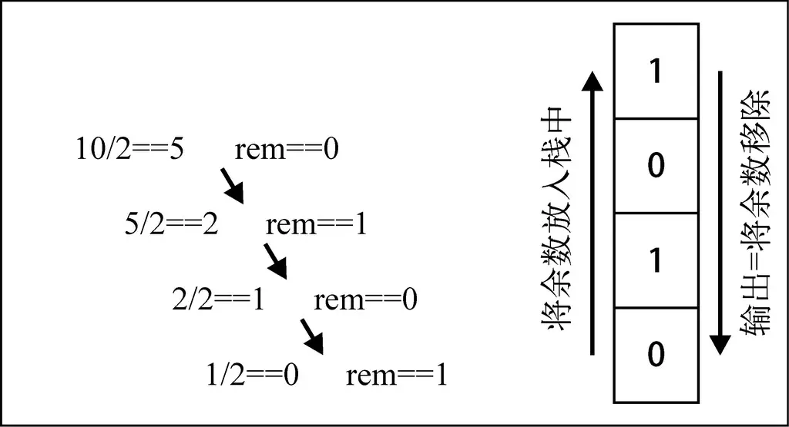

# 栈

## 一. 认识栈结构

### 栈结构

* 栈
数组是一个线性结构，并且可以在数组的任意位置插入和删除元素。而栈和队列就是比较常见的受限的线性结构。
栈是一种运算受限的线性表，后进先出(LIFO：last in first out)

* 栈结构的图解


* 程序中的栈

  * 函数调用栈：A(B(C(D())))： 即 A 函数中调用 B，B 调用 C，C 调用 D；在 A 执行的过程中会将 A 压入栈，随后 B 执行时 B 也被压入栈，函数 C 和 D 执行时也会被压入栈。所以当前栈的顺序为：A->B->C->D（栈顶）；函数 D 执行完之后，会弹出栈被释放，弹出栈的顺序为 D->C->B->A;

  * 递归： 为什么没有停止条件的递归会造成栈溢出？比如函数 A 为递归函数，不断地调用自己（因为函数还没有执行完，不会把函数弹出栈），不停地把相同的函数 A 压入栈，最后造成栈溢出（Queue Overfloat）。

### 栈面试题

题目：有 6 个元素 6，5，4，3，2，1 按顺序进栈，问下列哪一个不是合法的出栈顺序？

* A：5 4 3 6 1 2 （√）
* B：4 5 3 2 1 6 （√）
* C：3 4 6 5 2 1 （×）
* D：2 3 4 1 5 6 （√）
题目所说的按顺序进栈指的不是一次性全部进栈，而是有进有出，进栈顺序为 6 -> 5 -> 4 -> 3 -> 2 -> 1。

解析：

* A 答案：65 进栈，5 出栈，4 进栈出栈，3 进栈出栈，6 出栈，21 进栈，1 出栈，2 出栈（整体入栈顺序符合 654321）。
* B 答案：654 进栈，4 出栈，5 出栈，3 进栈出栈，2 进栈出栈，1 进栈出栈，6 出栈（整体的入栈顺序符合 654321）。
* C 答案：6543 进栈，3 出栈，4 出栈，之后应该 5 出栈而不是 6，所以错误。
* D 答案：65432 进栈，2 出栈，3 出栈，4 出栈，1 进栈出栈，5 出栈，6 出栈。符合入栈顺序。

## 二. 栈结构实现

### 栈的创建

* 我们先来创建一个栈的类, 用于封装栈相关的操作

    ``` javascript
    // 栈类
    function Stack() {
        // 栈中的属性
        var items = []
        
        // 栈相关的方法
    }
    ```

* 代码解析:

  * 我们创建了一个Stack构造函数, 用户创建栈的类.
  * 在构造函数中, 定义了一个变量, 这个变量可以用于保存当前栈对象中所有的元素.
  * 这个变量是一个数组类型. 我们之后无论是压栈操作还是出栈操作, 都是从数组中添加和删除元素.
  * 栈有一些相关的操作方法, 通常无论是什么语言, 操作都是比较类似的.

### 栈的操作

* 栈的常见操作

  * `push(element)`: 添加一个新元素到栈顶位置.
  * `pop()`：移除栈顶的元素，同时返回被移除的元素。
  * `peek()`：返回栈顶的元素，不对栈做任何修改（这个方法不会移除栈顶的元素，仅仅返回它）。
  * `isEmpty()`：如果栈里没有任何元素就返回`true`，否则返回`false`。
  * `clear()`：移除栈里的所有元素。
  * `size()`：返回栈里的元素个数。这个方法和数组的`length`属性很类似。

* push方法

  * 注意: 我们的实现是将最新的元素放在了数组的末尾, 那么数组末尾的元素就是我们的栈顶元素

    ``` javascript
    // 压栈操作
    this.push = function (element) {
        items.push(element)
    }
    ```

* pop方法

  * 注意: 出栈操作应该是将栈顶的元素删除, 并且返回.
  * 因此, 我们这里直接从数组中删除最后一个元素, 并且将该元素返回就可以了

    ``` javascript
    // 出栈操作
    this.pop = function (element) {
        return items.pop()
    }
    ```

* peek方法

  * peek方法是一个比较常见的方法, 主要目的是看一眼栈顶的元素.
  * 注意: 和pop不同, peek仅仅的瞥一眼栈顶的元素, 并不需要将这个元素从栈顶弹出.

    ``` javascript
    // peek操作
    this.peek = function () {
        return items[items.length - 1]
    } 
    ```

* isEmpty方法

  * isEmpty方法用户判断栈中是否有元素.
  * 实现起来非常简单, 直接判断数组中的元素个数是为0, 为0返回true, 否则返回false

    ``` javascript
    // 判断栈中的元素是否为空
    this.isEmpty = function () {
        return items.length == 0
    }
    ```

* size方法

  * size方法是获取栈中元素的个数.
  * 因为我们使用的是数组来作为栈的底层实现的, 所以直接获取数组的长度即可.(也可以使用链表作为栈的顶层实现)

    ``` javascript
    // 获取栈中元素的个数
    this.size = function () {
        return items.length
    }
    ```

### 完整代码

```  javascript
// 栈类
function Stack() {
    // 栈中的属性
    var items = []

    // 栈相关的方法
    // 压栈操作
    this.push = function (element) {
        items.push(element)
    }

    // 出栈操作
    this.pop = function () {
        return items.pop()
    }

    // peek操作
    this.peek = function () {
        return items[items.length - 1]
    }

    // 判断栈中的元素是否为空
    this.isEmpty = function () {
        return items.length == 0
    }

    // 获取栈中元素的个数
    this.size = function () {
        return items.length
    }
}
```

### 栈的使用

* 我们来使用封装的栈, 模拟刚才的面试题

    ``` javascript
    // 模拟面试题
    var stack = new Stack()
    
    // 情况下代码模拟
    stack.push(6)
    stack.push(5)
    stack.pop()     // 5
    stack.push(4)
    stack.pop()     // 4
    stack.push(3)
    stack.pop()     // 3
    stack.pop()     // 6
    stack.push(2)
    stack.push(1)
    stack.pop()     // 1
    stack.pop()     // 2
    ```

## 三. 十进制转二进制

* 要把十进制转化成二进制，我们可以将该十进制数字和2整除（二进制是满二进一），直到结果是0为止。

* 举个例子，把十进制的数字10转化成二进制的数字，过程大概是这样：


  
* 代码实现

    ``` javascript
    // 封装十进制转二进制的函数
    function dec2bin(decNumer) {
        // 定义变量
        var stack = new Stack()
        var remainder;
    
        // 循环除法
        while (decNumer > 0) {
            remainder = decNumer % 2
            decNumer = Math.floor(decNumer / 2)
            stack.push(remainder)
        }
    
        // 将数据取出
        var binayriStrng = ""
        while (!stack.isEmpty()) {
            binayriStrng += stack.pop()
        }
        return binayriStrng
    }
    ```

* 测试代码:

    ``` javascript
    // 测试函数
    alert(dec2bin(10))
    alert(dec2bin(233))
    alert(dec2bin(1000))
    ```
