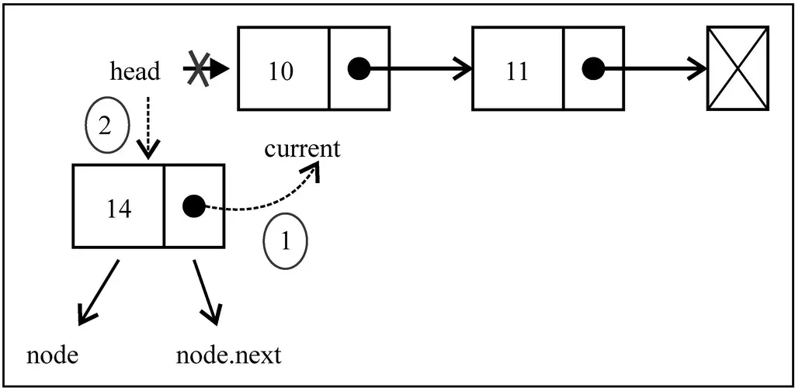
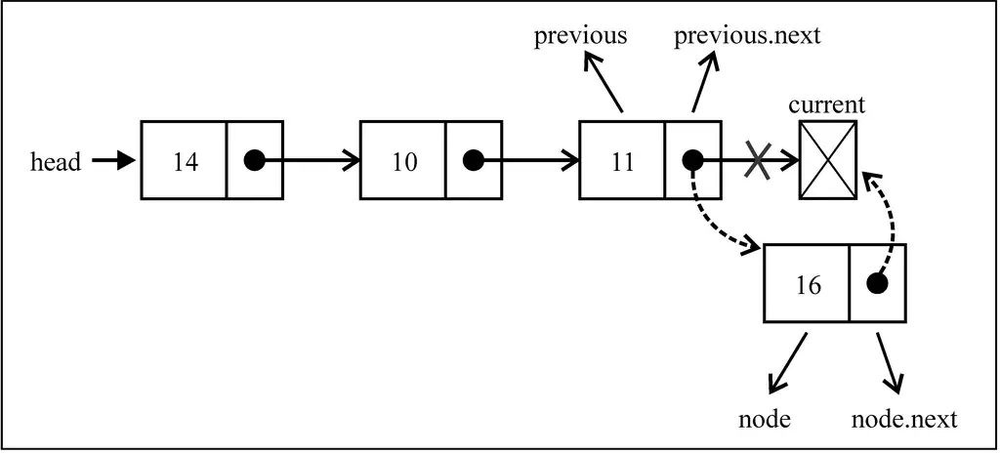
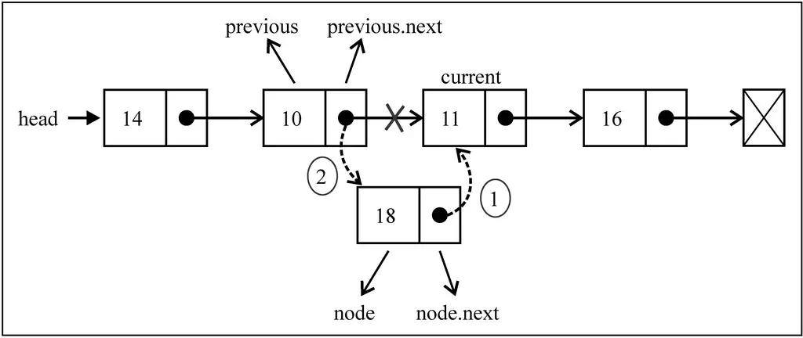

# 链表

## 一. 认识链表

### 链表和数组

* 数组:
  * 要存储多个元素，数组（或列表）可能是最常用的数据结构。
  * 几乎每一种编程语言都有默认实现数组结构, 这种数据结构非常方便，提供了一个便利的`[]`语法来访问它的元素。
  * 但是数组也有很多缺点:
    * 数组的创建通常需要申请一段连续的内存空间(一整块的内存), 并且大小是固定的(大多数编程语言数组都是固定的), 所以当当前数组不能满足容量需求时, 需要扩容。
    * 而且在数组开头或中间位置插入数据的成本很高, 需要进行大量元素的位移。
* 链表
  * 要存储多个元素, 另外一个选择就是使用链表.
  * 但不同于数组, 链表中的元素在内存中不必是连续的空间.
  * 链表的每个元素由一个存储元素本身的节点和一个指向下一个元素的引用(有些语言称为指针或者链接)组成.
  * 相对于数组, 链表有一些优点:
    * 内存空间不是比是连续的. 可以充分利用计算机的内存. 实现灵活的内存动态管理.
    * 链表不必在创建时就确定大小, 并且大小可以无限的延伸下去.
    * 链表在插入和删除数据时, 时间复杂度可以达到O(1). 相对数组效率高很多.
  * 相对于数组, 链表有一些缺点:
    * 链表访问任何一个位置的元素时, 都需要从头开始访问.(无法跳过第一个元素访问任何一个元素).
    * 无法通过下标直接访问元素, 需要从头一个个访问, 直到找到对应的问题.

### 链表的数据结构


## 二. 链表封装

### 创建链表类

``` javascript
// 封装链表的构造函数
function LinkedList() {
    // 封装一个Node类, 用于保存每个节点信息
    function Node(element) {
        this.element = element
        this.next = null
    }

    // 链表中的属性
    this.length = 0  // 链表的长度
    this.head = null // 链表的第一个节点
    
    // 链表中的方法
}
```

* 代码解析:

  * 封装LinkedList的类, 用于表示我们的链表结构.
  * 在LinkedList类中有一个Node类, 用于封装每一个节点上的信息.(和优先级队列的封装一样)
  * 链表中我们保存两个属性, 一个是链表的长度, 一个是链表中第一个节点.

### 链表的常见操作

* `append(element)`：向列表尾部添加一个新的项
* `insert(position, element)`：向列表的特定位置插入一个新的项。
* `remove(element)`：从列表中移除一项。
* `indexOf(element)`：返回元素在列表中的索引。如果列表中没有该元素则返回`-1`。
* `removeAt(position)`：从列表的特定位置移除一项。
* `isEmpty()`：如果链表中不包含任何元素，返回`true`，如果链表长度大于0则返回`false`。
* `size()`：返回链表包含的元素个数。与数组的`length`属性类似。
* `toString()`：由于列表项使用了`Node`类，就需要重写继承自JavaScript对象默认的`toString`方法，让其只输出元素的值。

## 三. 代码实现

### append方法

``` javascript
// 链表尾部追加元素方法
LinkedList.prototype.append = function (element) {
    // 1.根据新元素创建节点
    var newNode = new Node(element)

    // 2.判断原来链表是否为空
    if (this.head === null) { // 链表尾空
        this.head = newNode
    } else { // 链表不为空
        // 2.1.定义变量, 保存当前找到的节点
        var current = this.head
        while (current.next) {
            current = current.next
        }

        // 2.2.找到最后一项, 将其next赋值为node
        current.next = newNode
    }

    // 3.链表长度增加1
    this.length++
}
```

* 代码解读:

  * 首先需要做的是将element传入方法, 并根据element创建一个Node节点.

  * 场景一: 链表本身是空的, 比如这种情况下我们插入了一个15作为元素.


* 场景二: 链表中已经有元素了, 需要向最后的节点的next中添加节点.

  * 这个时候要向链表的尾部添加一个元素, 首先我们需要找到这个尾部元素.
  * 记住: 我们只有第一个元素的引用, 因此需要循环访问链表, 直接找到最后一个项.(见代码2.1)
  * 找到最后一项后, 最后一项的next为null, 这个时候不让其为null, 而是指向新创建的节点即可.


* 最后, 一定不要忘记将链表的length+1.

### toString方法

``` javascript
// 链表的toString方法
LinkedList.prototype.toString = function () {
    // 1.定义两个变量
    var current = this.head
    var listString = ""

    // 2.循环获取链表中所有的元素
    while (current) {
        listString += "," + current.element
        current = current.next
    }

    // 3.返回最终结果
    return listString.slice(1)
}
```

* 方法解读:

  * 该方法比较简单, 主要是获取每一个元素
  * 还是从head开头, 因为获取链表的任何元素都必须从第一个节点开头.
  * 循环遍历每一个节点, 并且取出其中的element, 拼接成字符串.
  * 将最终字符串返回.
* 测试append方法

    ```  javascript
    // 测试链表
    // 1.创建链表
    var list = new LinkedList()
    
    // 2.追加元素
    list.append(15)
    list.append(10)
    list.append(20)
    
    // 3.打印链表的结果
    alert(list)
    ```

### insert方法

``` javascript
// 根据下标删除元素
LinkedList.prototype.insert = function (position, element){
    // 1.检测越界问题: 越界插入失败
    if (position < 0 || position > this.length) returnfalse

    // 2.找到正确的位置, 并且插入数据
    var newNode = new Node(element)
    var current = this.head
    var previous = null
    index = 0

    // 3.判断是否列表是否在第一个位置插入
    if (position == 0) {
        newNode.next = current
        this.head = newNode
    } else {
        while (index++ < position) {
            previous = current
            current = current.next
        }
        
        newNode.next = current
        previous.next = newNode
    }
    
    // 4.length+1
    this.length++
    
    return true
}
```

* 代码解读:

  * 代码1的位置, 我们处理了越界问题, 基本传入位置信息时, 都需要进行越界的判断. 如果越界, 返回false, 表示数据添加失败. (因为位置信息是错误的, 所以数据肯定是添加失败的)

  * 代码2的位置, 我们定义了一些变量, 后续需要使用它们来保存信息.

  * 代码3的位置进行了判断, 这是因为添加到第一个位置和其他位置是不同的.

  * 添加到第一个位置:

    * 添加到第一个位置, 表示新添加的节点是头, 就需要将原来的头节点, 作为新节点的next
    * 另外这个时候的head应该指向新节点.



* 添加到其他位置:

  * 如果是添加到其他位置, 就需要先找到这个节点位置了.
  * 我们通过while循环, 一点点向下找. 并且在这个过程中保存上一个节点和下一个节点.
  * 找到正确的位置后, 将新节点的next指向下一个节点, 将上一个节点的next指向新的节点.




* 最后, 不要忘记length+1

* 返回true, 表示元素插入成功了.

* 测试insert的方式插入数据:

    ``` javascript
    // 4.测试insert方法
    list.insert(0, 100)
    list.insert(4, 200)
    list.insert(2, 300)
    alert(list) // 100,15,300,10,20,200
    ```

### removeAt方法

``` javascript
// 根据位置移除节点
LinkedList.prototype.removeAt = function (position) {
    // 1.检测越界问题: 越界移除失败, 返回null
    if (position < 0 || position >= this.length) returnnull

    // 2.定义变量, 保存信息
    var current = this.head
    var previous = null
    var index = 0
    
    // 3.判断是否是移除第一项
    if (position === 0) {
        this.head = current.next
    } else {
        while (index++ < position) {
            previous = current
            current = current.next
        }
        
        previous.next = current.next
    }
    
    // 4.length-1
    this.length--
    
    // 5.返回移除的数据
    return current.element
}
```

* 代码解析:

  * 代码1部分, 还是越界的判断. (注意: 这里越界判断中的等于length也是越界的, 因为下标值是从0开始的)

  * 代码2部分还是定义了一些变量, 用于保存临时信息

  * 代码3部分进行判断, 因为移除第一项和其他项的方式是不同的

  * 移除第一项的信息:

    * 移除第一项时, 直接让head指向第二项信息就可以啦.
    * 那么第一项信息没有引用指向, 就在链表中不再有效, 后面会被回收掉.


* 移除其他项的信息:

  * 移除其他项的信息操作方式是相同的.
  * 首先, 我们需要通过while循环, 找到正确的位置.
  * 找到正确位置后, 就可以直接将上一项的next指向current项的next, 这样中间的项就没有引用指向它, 也就不再存在于链表后, 会面会被回收掉.


* 测试removeAt方法

    ``` javascript
    // 5.测试removeAt方法
    list.removeAt(0)
    list.removeAt(1)
    list.removeAt(3)
    alert(list) // 15, 10, 20
    ```

### indexOf方法

``` javascript
// 根据元素获取链表中的位置
LinkedList.prototype.indexOf = function (element) {
    // 1.定义变量, 保存信息
    var current = this.head
    index = 0
    
    // 2.找到元素所在的位置
    while (current) {
        if (current.element === element) {
            return index
        }
        index++
        current = current.next
    }
    
    // 3.来到这个位置, 说明没有找到, 则返回-1
    return -1
}
```

* 代码解析:

  * 代码1的位置还是定义需要的变量.
  * 代码2的位置, 通过while循环获取节点
  * 通过节点获取元素和element进行对比, 如果和传入element相同, 表示找到, 直接返回index即可.
  * 如果没有找到, index++, 并且指向下一个节点.
  * 到最后都没有找到, 说明链表中没有对应的元素, 那么返回-1即可.
* indexOf方法测试

    ``` javascript
    // 6.测试indexOf方法
    alert(list.indexOf(15)) // 0
    alert(list.indexOf(10)) // 1
    alert(list.indexOf(20)) // 2
    alert(list.indexOf(100)) // -1
    ```

### remove方法

``` javascript
// 根据元素删除信息
LinkedList.prototype.remove = function (element) {
    var index = this.indexOf(element)
    return this.removeAt(index)
}
```

* 代码测试:

    ``` javascript
    // 7.测试remove方法
    list.remove(15)
    alert(list) // 10,20
    ```

### 其他方法

* isEmpty方法

    ``` javascript
    // 判断链表是否为空
    LinkedList.prototype.isEmpty = function () {
        return this.length == 0
    }
    ```

* size方法

    ``` javascript
    // 获取链表的长度
    LinkedList.prototype.size = function () {
        return this.length
    }
    ```

* 获取第一个元素节点: (单向链表比较方便的操作)

    ``` javascript
    // 获取第一个节点
    LinkedList.prototype.getFirst = function () {
        return this.head.element
    }
    ```

* 方法测试:

    ``` javascript
    // 8.测试其他方法
    alert(list.isEmpty()) // false
    alert(list.size()) // 2
    alert(list.getFirst()) // 10
    ```

## 四. 完整代码

``` javascript
// 封装链表的构造函数
function LinkedList() {
    // 封装一个Node类, 用于保存每个节点信息
    function Node(element) {
        this.element = element
        this.next = null
    }

    // 链表中的属性
    this.length = 0
    this.head = null

    // 链表尾部追加元素方法
    LinkedList.prototype.append = function (element) {
        // 1.根据新元素创建节点
        var newNode = new Node(element)

        // 2.判断原来链表是否为空
        if (this.head === null) { // 链表尾空
            this.head = newNode
        } else { // 链表不为空
            // 2.1.定义变量, 保存当前找到的节点
            var current = this.head
            while (current.next) {
                current = current.next
            }

            // 2.2.找到最后一项, 将其next赋值为node
            current.next = newNode
        }

        // 3.链表长度增加1
        this.length++
    }

    // 链表的toString方法
    LinkedList.prototype.toString = function () {
        // 1.定义两个变量
        var current = this.head
        var listString = ""

        // 2.循环获取链表中所有的元素
        while (current) {
            listString += "," + current.element
            current = current.next
        }

        // 3.返回最终结果
        return listString.slice(1)
    }

    // 根据下标删除元素
    LinkedList.prototype.insert = function (position,element) {
        // 1.检测越界问题: 越界插入失败
        if (position < 0 || position > this.length) returnfalse

        // 2.定义变量, 保存信息
        var newNode = new Node(element)
        var current = this.head
        var previous = null
        index = 0

        // 3.判断是否列表是否在第一个位置插入
        if (position == 0) {
            newNode.next = current
            this.head = newNode
        } else {
            while (index++ < position) {
                previous = current
                current = current.next
            }

            newNode.next = current
            previous.next = newNode
        }

        // 4.length+1
        this.length++

        return true
    }

    // 根据位置移除节点
    LinkedList.prototype.removeAt = function (position) {
        // 1.检测越界问题: 越界移除失败, 返回null
        if (position < 0 || position >= this.length)return null

        // 2.定义变量, 保存信息
        var current = this.head
        var previous = null
        var index = 0

        // 3.判断是否是移除第一项
        if (position === 0) {
            this.head = current.next
        } else {
            while (index++ < position) {
                previous = current
                current = current.next
            }

            previous.next = current.next
        }

        // 4.length-1
        this.length--

        // 5.返回移除的数据
        return current.element
    }

    // 根据元素获取链表中的位置
    LinkedList.prototype.indexOf = function (element) {
        // 1.定义变量, 保存信息
        var current = this.head
        index = 0

        // 2.找到元素所在的位置
        while (current) {
            if (current.element === element) {
                return index
            }
            index++
            current = current.next
        }

        // 3.来到这个位置, 说明没有找到, 则返回-1
        return -1
    }

    // 根据元素删除信息
    LinkedList.prototype.remove = function (element) {
        var index = this.indexOf(element)
        return this.removeAt(index)
    }

    // 判断链表是否为空
    LinkedList.prototype.isEmpty = function () {
        return this.length == 0
    }

    // 获取链表的长度
    LinkedList.prototype.size = function () {
        return this.length
    }

    // 获取第一个节点
    LinkedList.prototype.getFirst = function () {
        return this.head.element
    }
}
```
