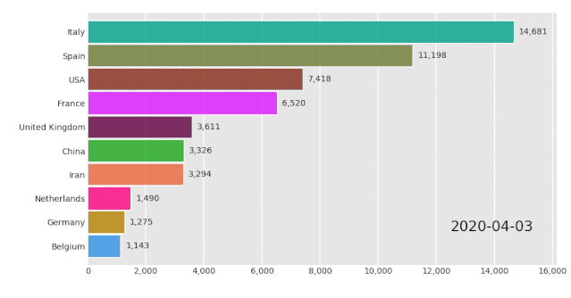
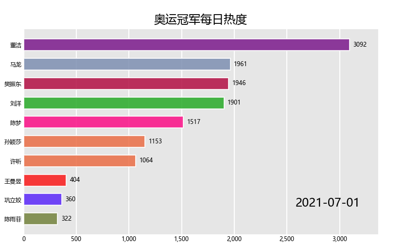

# bar-chart-race-条形图模块

## 前言

示例中的这种动图，可以由多种方法实现类似的效果：比如在线网站 Flourish ；数据可视化图表库 ECharts ；



本文通过 Python 的第三方模块 bar-chart-race 来制作一个东京奥运会冠军搜索热度视频。

## 数据获取

数据来源于百度搜索指数，使用baidux库获取，类似的爬虫库还有 gopup 、 AKShare 等等。

首先从百度体育获取奥运冠军的姓名的列表：

``` python
import requests
from bs4 import BeautifulSoup
import csv

res_url = requests.get('https://tiyu.baidu.com/tokyoly/delegation/8567/tab/%E5%A5%96%E7%89%8C%E6%98%8E%E7%BB%86/current/0')
soup_url = BeautifulSoup(res_url.text, 'lxml')
a_list = soup_url.select('div#medal0 b-lazyload a')
div_list = soup_url.select('div#medal0 b-lazyload div.match-c-team-item.c-blocka.c-team-item.c-color.c-bottom-line-1px.wa-match-team-second-items')
data_list = []
for a in a_list:
    a0 = a.text.split()[0]
    data_list.append(a0)
for div in div_list:
    div0 = div.text.split()[0].split('/')
    for i in div0:
        data_list.append(i)
data_list = list(set(data_list))
print(data_list)
```

得到如下列表：

``` python
['邹敬园', '陈芋汐', '汪周雨', '吕小军', '吕扬', '全红婵', '杨皓然', '李发彬', '张家齐', '刘诗颖', '陈梦', '王曼昱', '李雯雯', '施廷懋', '钟天使', '崔晓桐', '卢云秀', '朱雪莹', '曹缘', '孙颖莎', '张雨霏', '张常鸿', '王懿律', '樊振东', '谌利军', '汤慕涵', '王涵', '侯志慧', '黄东萍', '王宗源', '张一璠', '杨浚瑄', '许昕', '董洁', '庞伟', '陈雨菲', '石智勇', '姜冉馨', '孙梦雅', '陈云霞', '刘洋', '马龙', '汪顺', '谢思埸', '巩立姣', '杨倩', '李冰洁', '孙一文', '张灵', '鲍珊菊', '管晨辰', '徐诗晓']
```

将列表格式调整为 baidux 需要的格式：

``` python
original_list = ['邹敬园', '陈芋汐', '汪周雨', '吕小军', '吕扬', '全红婵', '杨皓然', '李发彬', '张家齐', '刘诗颖', '陈梦', '王曼昱', '李雯雯', '施廷懋', '钟天使', '崔晓桐', '卢云秀', '朱雪莹', '曹缘', '孙颖莎', '张雨霏', '张常鸿', '王懿律', '樊振东',
                 '谌利军', '汤慕涵', '王涵', '侯志慧', '黄东萍', '王宗源', '张一璠', '杨浚瑄', '许昕', '董洁', '庞伟', '陈雨菲', '石智勇', '姜冉馨', '孙梦雅', '陈云霞', '刘洋', '马龙', '汪顺', '谢思埸', '巩立姣', '杨倩', '李冰洁', '孙一文', '张灵', '鲍珊菊', '管晨辰', '徐诗晓']
final_list = []
for i in original_list:
    list_var = []
    list_var.append(i)
    final_list.append(list_var)
print(final_list)
```

结果如下：

``` python
[['邹敬园'], ['陈芋汐'], ['汪周雨'], ['吕小军'], ['吕扬'], ['全红婵'], ['杨皓然'], ['李发彬'], ['张家齐'], ['刘诗颖'], ['陈梦'], ['王曼昱'], ['李雯雯'], ['施廷懋'], ['钟天使'], ['崔晓桐'], ['卢云秀'], ['朱雪莹'], ['曹缘'], ['孙颖莎'], ['张雨霏'], ['张常鸿'], ['王懿律'], ['樊振东'], ['谌利军'], ['汤慕涵'], ['王涵'], ['侯志慧'], ['黄东萍'], ['王宗源'], ['张一璠'], ['杨浚瑄'], ['许昕'], ['董洁'], ['庞伟'], ['陈雨菲'], ['石智勇'], ['姜冉馨'], ['孙梦雅'], ['陈云霞'], ['刘洋'], ['马龙'], ['汪顺'], ['谢思埸'], ['巩立姣'], ['杨倩'], ['李冰洁'], ['孙一文'], ['张灵'], ['鲍珊菊'], ['管晨辰'], ['徐诗晓']]
```

使用 baidux 获取百度指数数据：

``` python
from baidux import BaiduIndex
import pandas as pd

cookies = '浏览器cookies'
keywords = [['邹敬园'], ['陈芋汐'], ['汪周雨'], ['吕小军'], ['吕扬'], ['全红婵'], ['杨皓然'], ['李发彬'], ['张家齐'], ['刘诗颖'], ['陈梦'], ['王曼昱'], ['李雯雯'], ['施廷懋'], ['钟天使'], ['崔晓桐'], ['卢云秀'], ['朱雪莹'], ['曹缘'], ['孙颖莎'], ['张雨霏'], ['张常鸿'], ['王懿律'], ['樊振东'], ['谌利军'], ['汤慕涵'], ['王涵'], ['侯志慧'], ['黄东萍'], ['王宗源'], ['张一璠'], ['杨浚瑄'], ['许昕'], ['董洁'], ['庞伟'], ['陈雨菲'], ['石智勇'], ['姜冉馨'], ['孙梦雅'], ['陈云霞'], ['刘洋'], ['马龙'], ['汪顺'], ['谢思埸'], ['巩立姣'], ['杨倩'], ['李冰洁'], ['孙一文'], ['张灵'], ['鲍珊菊'], ['管晨辰'], ['徐诗晓']]
baidu_index = BaiduIndex(keywords=keywords,start_date='2021-07-01',end_date='2021-08-07',cookies=cookies,)
df = pd.DataFrame({})
for index in baidu_index.get_index():
    df = df.append(index, ignore_index=True)
df.to_csv('百度搜索指数.csv')
```

得到如下数据：

``` python
,keyword,type,date,index
0,['邹敬园'],all,2021-07-01,0
1,['邹敬园'],all,2021-07-02,0
2,['邹敬园'],all,2021-07-03,0
...
...
...
1897,['徐诗晓'],all,2021-08-05,0
1898,['徐诗晓'],all,2021-08-06,0
1899,['徐诗晓'],all,2021-08-07,41535
```

## 安装 bar-chart-race

``` bash
pip install bar_chart_race
```

## 生成动图

``` python
import bar_chart_race as bcr
import pandas as pd

df = pd.read_csv('百度搜索指数.csv')
df['keyword'] = df['keyword'].map(lambda x: x[2:-2])
df = df.pivot(index='date', columns='keyword', values='index')
for col in df.columns:
    df[col] = df[col].cumsum()
add_end = df.loc['2021-08-07']
df = df.append(add_end)

bcr.bar_chart_race(
    # Pandas中的DataFrame数据
    df,
    # 文件保存路径
    filename='bar_chart_race.mp4',
    # 标题
    title='奥运冠军每日热度',
    # 图像大小及DPI
    fig_kwargs={'figsize': (6.6667, 3.75), 'dpi': 288},
    # 条形数量
    n_bars=10,
    # 透明度
    bar_kwargs={'alpha': 0.7},
    # 设置True可以避免颜色重复
    filter_column_colors=True,
    # 字体大小
    tick_label_font=6,
    bar_label_font=6,
    # 条形尺寸
    bar_size=0.6,
    # 文本格式模板，保留0位小数
    bar_texttemplate='{x:.0f}',
    # period_template='{x:.0f}',

    # 类似于动画的帧数
    # steps_per_period=10,
    # 每段动画的时长/ms
    period_length=1200,
    # 每段动画结尾暂停时长/ms
    end_period_pause=200
)
```

## 最终效果


