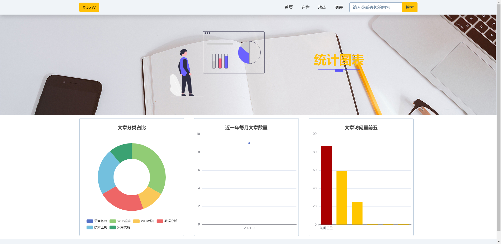

# Django 模板中添加 Echarts

## 前言

ECharts 是一款基于 JavaScript 的数据可视化图表库，提供直观，生动，可交互，可个性化定制的数据可视化图表。

?> 文档：<https://echarts.apache.org/handbook/zh/get-started/>

## 安装

``` bash
npm install echarts --save
```

- 或使用 CDN ：<https://www.jsdelivr.com/package/npm/echarts>

## 图表容器

在 HTML 中先定义一个 `<div>` 节点，并且通过 CSS 使得该节点具有宽度和高度。初始化的时候，传入该节点，图表的大小默认即为该节点的大小，除非声明了 opts.width 或 opts.height 将其覆盖。

``` html
<div id="main" style="width: 600px;height:400px;"></div>
<script type="text/javascript">
  var myChart = echarts.init(document.getElementById('main'));
</script>
```

## 鼠标事件

ECharts 支持常规的鼠标事件类型，包括 click、 dblclick、 mousedown、 mousemove、 mouseup、 mouseover、 mouseout、 globalout、 contextmenu 事件。
示例：

``` javascript
var option = {
  xAxis: {
    data: ['衬衫', '羊毛衫', '雪纺衫', '裤子', '高跟鞋', '袜子']
  },
  yAxis: {},
  series: [
    {
      name: '销量',
      type: 'bar',
      data: [5, 20, 36, 10, 10, 20]
    }
  ]
};
myChart.setOption(option);
// 处理点击事件并且跳转到相应的百度搜索页面
myChart.on('click', function(params) {
  window.open('https://www.baidu.com/s?wd=' + encodeURIComponent(params.name));
});
```

## 模板

``` html
<div class="col-xxl-4 my-3 d-flex">
    <div class="card border">
        <div id="category_pie" style="width:400px;height:450px;"></div>
        <script>
            var chartDom = documentgetElementById('category_pie');
            var myChart = echarts.init(chartDom);
            var option;
            option = {
                title: {
                    text: '文章分类占比',
                    top: '5%',
                    left: 'center'
                },
                tooltip: {
                    trigger: 'item'
                },
                legend: {
                    top: '85%',
                    left: 'center'
                },
                series: [
                    {
                        name: '专栏名称',
                        type: 'pie',
                        radius: ['35%', '65%'],
                        avoidLabelOverlap: false,
                        label: {
                            show: false,
                            position: 'center'
                        },
                        emphasis: {
                            label: {
                                show: true,
                                fontSize: '20',
                                fontWeight:'bold'
                            }
                        },
                        labelLine: {
                            show: false
                        },
                        data: {{ category_list |safe }}
                    }
                ]
            };
            option && myChart.setOption(option);
            myChart.on('click', function(params) {
                window.open("category=" + encodeURIComponen(params.name));
            });
        </script>
    </div>
</div>
<div class="col-xxl-4 my-3 d-flex">
    <div class="card border">
        <div id="counts_line" style="width:400px;height:450px;"></div>
        <script>
            var chartDom = documentgetElementById('counts_line');
            var myChart = echarts.init(chartDom);
            var option;
            option = {
                title: {
                    text: '近一年每月文章数量',
                    top: '5%',
                    left: 'center'
                },
                tooltip: {
                    trigger: 'axis'
                },
                grid: {
                    left: '2%',
                    right: '2%',
                    bottom: '5%',
                    containLabel: true
                },
                xAxis: {
                    type: 'category',
                    data: {{ count_month_list |safe }},
                },
            yAxis: {
                type: 'value'
            },
            series: [{
                data: {{ count_value_list }},
                type: 'line',
                smooth: true
            }]
            };
            option && myChart.setOption(option);
        </script>
    </div>
</div>
<div class="col-xxl-4 my-3 d-flex">
    <div class="card border">
        <div id="everyday_view_bar"style="width: 400px;height:450px;"></div>
        <script>
            var chartDom = documentgetElementById('everyday_view_bar');
            var myChart = echarts.init(chartDom);
            var option;
            option = {
                title: {
                    text: '文章访问量前五',
                    top: '5%',
                    left: 'center'
                },
                tooltip: {
                    trigger: 'axis',
                    axisPointer: {
                        type: 'shadow'
                    }
                },
                grid: {
                    left: '2%',
                    right: '2%',
                    bottom: '5%',
                    containLabel: true
                },
                xAxis: {
                    type: 'category',
                    data: {{ title_list | safe }}
                },
            yAxis: {
                type: 'value'
            },
            series: [{
                data: [{
                    value: {{ total_view }},
                itemStyle: { color: '#a90000' }, {{ view_0 }}, {{ view_1 }}, {{ view_2 }}, {{ view_3 }}, {{ view_4 }},],
                itemStyle: {
                color: '#ffc600'
            },
            type: 'bar'
                }]
            };
            option && myChart.setOption(option);
            myChart.on('click', function(params) {
                window.open("" +encodeURIComponent(params.name));
            });
        </script>
    </div>
</div>
```

- 饼图、折线图、柱状图所需的数据已经被替换为 Django 后端传递过来的参数：
- 饼图的 data 是 category_list ；
- 折线图的X轴的 data 是 count_month_list 、Y轴的 data 是 count_value_list ；
- 柱状图的X轴 data 是 title_list 、柱状图的Y轴 value 分别是 total_view 、 view_0 、 view_1 、 view_2 、 view_3 、 view_4 。

## 饼图

饼图需要的 data 是以 name 和 value 组成的字典为元素的列表：

``` python
# views.py
categorys = Category.objects.all()
    category_list = []
    for category in categorys:
        category_value = Post.objects.filter(category__name=category.name).count()
        category_dict = dict(name=category.name, value=category_value)
        category_list.append(category_dict)
```

并且图表中添加了鼠标点击事件：当鼠标点击饼图某一块时，浏览器会打开类似点击该分类按钮的页面。

``` javascript
myChart.on('click', function (params) {
    window.open("?category=" + encodeURIComponent(params.name));
                            });
```

## 折线图

折线图需要的数据是两组分别对应X、Y轴参数的列表，近一年每月的文章数量如下：

``` python
# views.py
one_year_ago = datetime.now() - relativedelta(years=1)
posts_nearly_year = Post.objects.filter(add_time__gte=one_year_ago)
class_count = posts_nearly_year.annotate(
    year=ExtractYear('add_time'), month=ExtractMonth('add_time')
    ).values('', 'month').order_by('year', 'month').annotate(Count('title'))
count_month_list = []
count_value_list = []
for i in class_count:
    count_month_list.append(str(i['year']) + '-' + str(i['month']))
    count_value_list.append(i['title__count'])
```

## 柱状图

柱状图与折线图类似：

``` python
# views.py
posts_by_view = Post.objects.all().order_by('-view_count')
posts_top_5 = posts_by_view[:5]
total_view = 0
for post in posts_by_view:
    total_view += post.view_count
view_list = []
title_list = ['访问总量', ]
for post in posts_top_5:
    view_list.append(post.view_count)
    title_list.append(post.title)
view_0 = view_list[0]
view_1 = view_list[1]
view_2 = view_list[2]
view_3 = view_list[3]
view_4 = view_list[4]
```

添加了鼠标点击事件：当鼠标点击访问总量柱时，浏览器会打开博客首页；点击其他柱时，会打开对应文章页面。

``` javascript
myChart.on('click', function (params) {
    if (params.name == '访问总量') {
        window.open("");
    }
    else {
        window.open("" + encodeURIComponent(params.name));
    }
});
```

## 完整的视图

``` python
# views.py
from datetime import datetime
from dateutil.relativedelta import relativedelta
def charts_posts(request):
    categorys = Category.objects.all()
    category_list = []
    for category in categorys:
        category_value = Post.objects.filter(category__name=category.name).count()
        category_dict = dict(name=category.name, value=category_value)
        category_list.append(category_dict)

    one_year_ago = datetime.now() - relativedelta(years=1)
    posts_nearly_year = Post.objects.filter(add_time__gte=one_year_ago)
    class_count = posts_nearly_year.annotate(
        year=ExtractYear('add_time'), month=ExtractMonth('add_time')
        ).values('year', 'month').order_by('year', 'month').annotate(Count('title'))
    count_month_list = []
    count_value_list = []
    for i in class_count:
        count_month_list.append(str(i['year']) + '-' + str(i['month']))
        count_value_list.append(i['title__count'])

    posts_by_view = Post.objects.all().order_by('-view_count')
    posts_top_5 = posts_by_view[:5]
    total_view = 0
    for post in posts_by_view:
        total_view += post.view_count
    view_list = []
    title_list = ['访问总量', ]
    for post in posts_top_5:
        view_list.append(post.view_count)
        title_list.append(post.title)
    try:
        view_0 = view_list[0]
        view_1 = view_list[1]
        view_2 = view_list[2]
        view_3 = view_list[3]
        view_4 = view_list[4]
        return render(
            request,
            'blog/charts.html',
            {
                'category_list': category_list,
                'count_month_list': count_month_list,
                'count_value_list': count_value_list,
                'title_list': title_list,
                'total_view': total_view,
                'view_0': view_0,
                'view_1': view_1,
                'view_2': view_2,
                'view_3': view_3,
                'view_4': view_4
                }
            )
    except:
        return render(
            request,
            'blog/charts.html',
            {
                'category_list': category_list,
                'count_month_list': count_month_list,
                'count_value_list': count_value_list,
                'title_list': title_list,
                'total_view': total_view
                }
            )
```

## 预览


