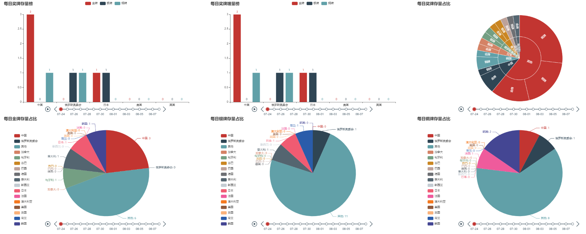

# pyecharts-可视化图表库

## 前言

ECharts 是一款由百度团队开源、基于 JavaScript 的数据可视化图表库，pyecharts 是 ECharts 的 Python 版本。

?> 文档：<https://pyecharts.org/#/zh-cn/intro>

## 数据来源

百度体育：<https://tiyu.baidu.com/tokyoly/home/tab/%E5%A5%96%E7%89%8C%E6%A6%9C>

## 数据获取

### 各国代表团的页面网址

各国代表团的数据都在新的页面呈现，而首页的 `div.ranklist` 的a标签中含有新页面网址的结尾，例如：
**href="//tiyu.baidu.com/tokyoly/delegation/8705/tab/奖牌明细"**
由此获取各国代表团的页面网址：

``` python
import requests
from bs4 import BeautifulSoup
url_home = 'https://tiyu.baidu.com/tokyoly/home/tab/%E5%A5%96%E7%89%8C%E6%A6%9C/from/pc'
res_home = requests.get(url_home)
soup_home = BeautifulSoup(res_home.text, 'lxml')
rank_list = soup_home.select('div.rank-list a')
url_list = []
for r in rank_list:
    url_list.append(r['href'])
```

其中，url_list是各国代表团数据页面网址结尾的列表。

### 各国代表团的奖牌数量

来到各国代表团的数据页面，`span.main.c-line-clamp1` 中含有代表团名称，

- `div#medal0 b-lazyload` a中含有个人赛金牌数据，
- `div#medal0 b-lazyload` div中含有团体赛金牌数据，
- `div#medal1 b-lazyload` a中含有个人赛银牌数据，
- `div#medal1 b-lazyload` div中含有团体赛银牌牌数据，
- `div#medal2 b-lazyload` a中含有个人赛铜牌数据，
- `div#medal2 b-lazyload` div中含有团体赛铜牌数据

由此获取各国代表团奖牌数量，并以csv格式保存：

``` python
import csv
for url in url_list:
    res_medal = requests.get('https:' + url)
    soup_medal = BeautifulSoup(res_medal.text, 'lxml')
    country = soup_medal.select('span.main.c-line-clamp1')[0].text
    a0_list = soup_medal.select('div#medal0 b-lazyload a')
    div0_list = soup_medal.select(
        'div#medal0 b-lazyload div.match-c-team-item.c-blocka.c-team-item.c-color.c-bottom-line-1px.wa-match-team-second-items')
    a1_list = soup_medal.select('div#medal1 b-lazyload a')
    div1_list = soup_medal.select(
        'div#medal1 b-lazyload div.match-c-team-item.c-blocka.c-team-item.c-color.c-bottom-line-1px.wa-match-team-second-items')
    a2_list = soup_medal.select('div#medal2 b-lazyload a')
    div2_list = soup_medal.select(
        'div#medal2 b-lazyload div.match-c-team-item.c-blocka.c-team-item.c-color.c-bottom-line-1px.wa-match-team-second-items')

    data_list = []
    for a in a0_list:
        a0 = a.text.split()[-1::]
        a0.append(country)
        a0.append('金牌')
        data_list.append(a0)
    for div in div0_list:
        div0 = div.text.split()[-1::]
        div0.append(country)
        div0.append('金牌')
        data_list.append(div0)
    for a in a1_list:
        a0 = a.text.split()[-1::]
        a0.append(country)
        a0.append('银牌')
        data_list.append(a0)
    for div in div1_list:
        div0 = div.text.split()[-1::]
        div0.append(country)
        div0.append('银牌')
        data_list.append(div0)
    for a in a2_list:
        a0 = a.text.split()[-1::]
        a0.append(country)
        a0.append('铜牌')
        data_list.append(a0)
    for div in div2_list:
        div0 = div.text.split()[-1::]
        div0.append(country)
        div0.append('铜牌')
        data_list.append(div0)

    with open('东京奥运奖牌明细.csv', 'a', encoding='utf8') as f:
        writer = csv.writer(f, delimiter=',')
        writer.writerows(data_list)
```

得到如下数据：

``` python
08-08,美国,金牌
08-08,美国,金牌
08-08,美国,金牌
08-07,美国,金牌
...
...
...
08-07,摩尔多瓦,金牌
08-07,摩尔多瓦,银牌
08-04,叙利亚,金牌
08-04,叙利亚,银牌
```

## 目标

- 将金牌榜前5名的代表团的金、银、铜的每日存量数据和增量数据以柱状图呈现出来；
- 将前n名的代表团及剩余代表团的金、银、铜每日存量数据分别以饼图呈现出来；
- 将前n名的代表团及剩余代表团的金、银、铜每日存量数据一次性以旭日图呈现出来。
- 将所有图放在一个页面内。

## 实现思路

- 使用pyecharts绘制柱状图，需要将数据处理成两类列表，一类提供给X轴，一类提供给Y轴；
- 绘制饼图，需要将数据处理成以元组形式作为元素的列表，元组的两个值分别代表饼图的类别及其数值；
- 绘制旭日图，需要明确类别、子类别及其数值。
- 带时间轴的柱状图则是由不同时间下的多个独立柱状图组合而成，具体形式如下：

``` python
from pyecharts import options as opts
from pyecharts.charts import Bar, Timeline
tl = Timeline()
for i in range(2015, 2020):
    bar = (
        Bar()
        .add_xaxis(x列表)
        .add_yaxis("商家", y列表)
        .set_global_opts(title_opts=opts.TitleOpts("某商店营业额"))
    )
    tl.add(bar, i)
```

饼图和旭日图类似。
另外，顺序多图的组合形式如下：

``` python
from pyecharts.charts import page
page = Page(layout=Page.SimplePageLayout)
#选择组合类型，也可以是可移动调整的：page = Page(layout=Page.DraggablePageLayout)
page.add(chart1,chart2,chart3,)
page.render()
```

## 读取数据

- 保留前16名代表团的名称，替换其他代表团名称为`其他`；
- 统计不同的行数据出现的次数，即各代表团某日获得的某种奖牌的数量；
- 重置索引：

``` python
import pandas as pd
df = pd.read_csv('东京奥运奖牌明细.csv', names=['日期', '国家/地区', '奖牌种类'])
for i in df.index.tolist():
    if df.loc[i, '国家/地区'] in ['中国', '美国', '日本', '澳大利亚', '俄罗斯奥委会', '英国', '荷兰', '法国', '德国', '意大利', '加拿大', '巴西', '新西兰', '古巴', '匈牙利', '韩国']:
        pass
    else:
        df.loc[i, '国家/地区'] = '其他'
data = df.value_counts()
df = data.to_frame()
df = df.reset_index()
```

数据形式将发生如下转变：

``` python
08-08,美国,金牌
08-08,美国,金牌
08-08,美国,金牌
08-07,美国,金牌
...
...
...
08-07,摩尔多瓦,金牌
08-07,摩尔多瓦,银牌
08-04,叙利亚,金牌
08-04,叙利亚,银牌
```

↓↓↓

``` python
      日期    国家/地区        奖牌种类        0
0     08-07     其他            银牌         22
1     08-07     其他            金牌         18
2     08-05     其他            金牌         15
3     08-05     其他            铜牌         15
...
...
...
460    07-31    俄罗斯奥委会    金牌          1
461    07-31    中国            铜牌         1
462    07-30    韩国            银牌         1
463    08-08    荷兰            银牌         1
```

## 柱状图（存量数据）

- 过滤掉前5名以外的数据；
- 分别筛选出金、银、铜牌的数据；
- 分别对金、银、铜牌的数据使用pivot函数将列值旋转为以日期为索引、以国家/地区为列的数据形式；
- 对数据缺失的部分填充为0；
- 最后，使用cumsum函数对列数据计算累加值，即奖牌的存量。

``` python
df_bar = df[df['国家/地区'].isin(['中国', '美国', '日本', '英国', '俄罗斯奥委会'])]
df_bar_0_cumsum = df_bar[df_bar['奖牌种类'] == '金牌']
df_bar_0_cumsum = df_bar_0_cumsum.pivot(index='日期', columns='国家/地区', values=0)
df_bar_0_cumsum.fillna(0, inplace=True)
for col in df_bar_0_cumsum.columns:
    df_bar_0_cumsum[col] = df_bar_0_cumsum[col].cumsum()
df_bar_1_cumsum = df_bar[df_bar['奖牌种类'] == '银牌']
df_bar_1_cumsum = df_bar_1_cumsum.pivot(index='日期', columns='国家/地区', values=0)
df_bar_1_cumsum.fillna(0, inplace=True)
for col in df_bar_1_cumsum.columns:
    df_bar_1_cumsum[col] = df_bar_1_cumsum[col].cumsum()
df_bar_2_cumsum = df_bar[df_bar['奖牌种类'] == '铜牌']
df_bar_2_cumsum = df_bar_2_cumsum.pivot(index='日期', columns='国家/地区', values=0)
df_bar_2_cumsum.fillna(0, inplace=True)
for col in df_bar_2_cumsum.columns:
    df_bar_2_cumsum[col] = df_bar_2_cumsum[col].cumsum()
df_bar_2_cumsum.loc['08-08'] = df_bar_2_cumsum.loc['08-07']
```

整理后的数据如下：

``` python
国家/地区    中国 俄罗斯奥委会 日本     美国     英国
日期
07-24        3.0     0.0     1.0     0.0     0.0
07-25        6.0     1.0     5.0     4.0     0.0
07-26        6.0     4.0     8.0     7.0     3.0
07-27        9.0     7.0     10.0    9.0     4.0
07-28        12.0    7.0     13.0    11.0    5.0
07-29        15.0    8.0     15.0    14.0    5.0
07-30        19.0    10.0    17.0    14.0    6.0
07-31        21.0    11.0    18.0    16.0    8.0
08-01        24.0    12.0    18.0    20.0    10.0
08-02        29.0    12.0    18.0    22.0    11.0
08-03        32.0    13.0    19.0    24.0    12.0
08-04        32.0    14.0    21.0    25.0    15.0
08-05        34.0    16.0    22.0    29.0    16.0
08-06        36.0    17.0    24.0    31.0    18.0
08-07        38.0    20.0    27.0    36.0    20.0
08-08        38.0    20.0    27.0    39.0    22.0
```

使用pyecharts绘制柱状图：

``` python
from pyecharts import options as opts
from pyecharts.charts import Bar, Timeline
tl_bar_cumsum = Timeline()
for i in df_bar_0_cumsum.index.tolist():
    bar_cumsum = (
        Bar()
        .add_xaxis(df_bar_0_cumsum.columns.tolist())
        .add_yaxis('金牌', df_bar_0_cumsum.loc[i].tolist())
        .add_yaxis('银牌', df_bar_1_cumsum.loc[i].tolist())
        .add_yaxis('铜牌', df_bar_2_cumsum.loc[i].tolist())
        .set_global_opts(title_opts=opts.TitleOpts('每日奖牌存量榜'))
    )
    tl_bar_cumsum.add(bar_cumsum, i)
```

## 柱状图（增量数据）

类似的，筛选奖牌数据、旋转数据，由于 08-08 没有铜牌产生，所以赋值整行数据是 0 ：

``` python
df_bar_0 = df_bar[df_bar['奖牌种类'] == '金牌']
df_bar_0 = df_bar_0.pivot(index='日期', columns='国家/地区', values=0)
df_bar_0.fillna(0, inplace=True)
df_bar_1 = df_bar[df_bar['奖牌种类'] == '银牌']
df_bar_1 = df_bar_1.pivot(index='日期', columns='国家/地区', values=0)
df_bar_1.fillna(0, inplace=True)
df_bar_2 = df_bar[df_bar['奖牌种类'] == '铜牌']
df_bar_2 = df_bar_2.pivot(index='日期', columns='国家/地区', values=0)
df_bar_2.fillna(0, inplace=True)
df_bar_2.loc['08-08'] = 0
tl_bar = Timeline()
for i in df_bar_0.index.tolist():
    bar = (
        Bar()
        .add_xaxis(df_bar_0.columns.tolist())
        .add_yaxis('金牌', df_bar_0.loc[i].tolist())
        .add_yaxis('银牌', df_bar_1.loc[i].tolist())
        .add_yaxis('铜牌', df_bar_2.loc[i].tolist())
        .set_global_opts(title_opts=opts.TitleOpts('每日奖牌增量榜'))
    )
    tl_bar.add(bar, i)
```

## 饼图

数据处理部分也是类似的：

``` python
from pyecharts.charts import Pie
df_0_cumsum = df[df['奖牌种类'] == '金牌']
df_0_cumsum = df_0_cumsum.pivot(index='日期', columns='国家/地区', values=0)
df_0_cumsum.fillna(0, inplace=True)
for col in df_0_cumsum.columns:
    df_0_cumsum[col] = df_0_cumsum[col].cumsum()
df_1_cumsum = df[df['奖牌种类'] == '银牌']
df_1_cumsum = df_1_cumsum.pivot(index='日期', columns='国家/地区', values=0)
df_1_cumsum.fillna(0, inplace=True)
for col in df_1_cumsum.columns:
    df_1_cumsum[col] = df_1_cumsum[col].cumsum()
df_2_cumsum = df[df['奖牌种类'] == '铜牌']
df_2_cumsum = df_2_cumsum.pivot(index='日期', columns='国家/地区', values=0)
df_2_cumsum.fillna(0, inplace=True)
for col in df_2_cumsum.columns:
    df_2_cumsum[col] = df_2_cumsum[col].cumsum()
```

饼图需要 以元组作为元素的列表形式的数据，以金牌数据为例，

- df_0_cumsum.columns.tolist()是列名称的列表，
- df_0_cumsum.loc[i].tolist()是单日数据的列表，
- list(zip(列名称列表,单日数据列表))即是饼图所需要的数据形式。

分别绘制金、银、铜牌数据的三个饼图：

``` python
tl_pie_0 = Timeline()
for i in df_0_cumsum.index.tolist():
    word_list = list(zip(df_0_cumsum.columns.tolist(),
                         df_0_cumsum.loc[i].tolist()))
    pie_0 = (
        Pie()
        .add('', word_list)
        .set_global_opts(title_opts=opts.TitleOpts(title='每日金牌存量占比'), legend_opts=opts.LegendOpts(orient='vertical', pos_left='5%', pos_top='15%'))
        .set_series_opts(label_opts=opts.LabelOpts(formatter='{b}: {c}'))
    )
    tl_pie_0.add(pie_0, i)
tl_pie_1 = Timeline()
for i in df_1_cumsum.index.tolist():
    word_list = list(zip(df_1_cumsum.columns.tolist(),
                         df_1_cumsum.loc[i].tolist()))
    print(word_list)
    pie_1 = (
        Pie()
        .add('', word_list)
        .set_global_opts(title_opts=opts.TitleOpts(title='每日银牌存量占比'), legend_opts=opts.LegendOpts(orient='vertical', pos_left='5%', pos_top='15%'))
        .set_series_opts(label_opts=opts.LabelOpts(formatter='{b}: {c}'))
    )
    tl_pie_1.add(pie_1, i)
tl_pie_2 = Timeline()
for i in df_2_cumsum.index.tolist():
    word_list = list(zip(df_2_cumsum.columns.tolist(),
                         df_2_cumsum.loc[i].tolist()))
    pie_2 = (
        Pie()
        .add('', word_list)
        .set_global_opts(title_opts=opts.TitleOpts(title='每日铜牌存量占比'), legend_opts=opts.LegendOpts(orient='vertical', pos_left='5%', pos_top='15%'))
        .set_series_opts(label_opts=opts.LabelOpts(formatter='{b}: {c}'))
    )
    tl_pie_2.add(pie_2, i)
```

## 旭日图

旭日图其实就是三张饼图的合并，里层是各个代表团，外层是各个代表团的三种奖牌的数据。
旭日图的数据的代码形式如下：

``` python
[opts.SunburstItem(name=父类别1,children=[opts.SunburstItem(name=子类别1.1,children=[...])]),opts.SunburstItem(name=父类别2,children=[opts.SunburstItem(name=子类别2.1,children=[...])]),...]
```

数据处理部分如下：

``` python
df_sun = df.pivot(index='日期', columns=['国家/地区', '奖牌种类'], values=0)
df_sun.fillna(0, inplace=True)
for col in df_sun.columns:
    df_sun[col] = df_sun[col].cumsum()
```

生成图表：

``` python
tl_sun = Timeline()
for d in df_sun.index.tolist():
    df_sun_d = df_sun.loc[d]
    data = []
    for i in ['中国', '美国', '日本', '澳大利亚', '俄罗斯奥委会', '英国', '荷兰', '法国', '德国', '意大利', '加拿大', '巴西', '新西兰', '古巴', '匈牙利', '韩国', '其他']:
        data += [opts.SunburstItem(name=i, children=[opts.SunburstItem(name='金牌', value=df_sun_d[i]['金牌']), opts.SunburstItem(
            name='银牌', value=df_sun_d[i]['银牌']), opts.SunburstItem(name='铜牌', value=df_sun_d[i]['铜牌'])])]
        sunburst = (
            Sunburst()
            .add(series_name="", data_pair=data)
            .set_global_opts(title_opts=opts.TitleOpts(title='每日奖牌存量占比'))
            .set_series_opts(label_opts=opts.LabelOpts(formatter="{b}")))
    tl_sun.add(sunburst, d)
```

## 顺序多图

以上一共绘制了6张图表，现在要将他们渲染在同一个页面，代码形式本文开头也已给出，下面是具体代码：

``` python
page = Page(layout=Page.SimplePageLayout)
page.add(tl_bar_cumsum, tl_bar, tl_sun, tl_pie_0, tl_pie_1, tl_pie_2)
page.render('东京奥运奖牌榜.html')
```

## 最终效果


